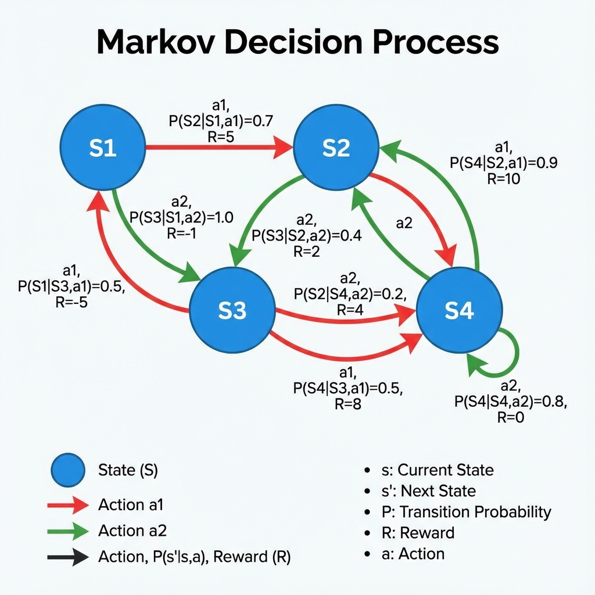
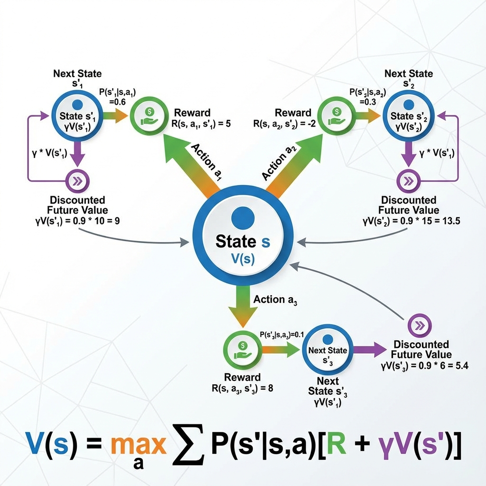
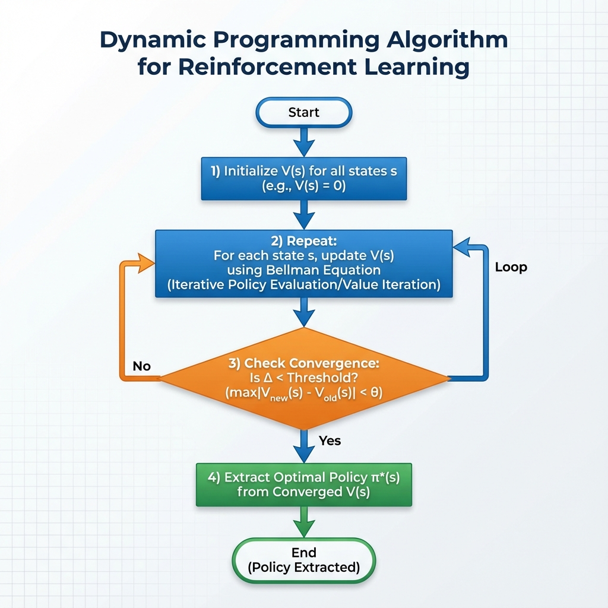
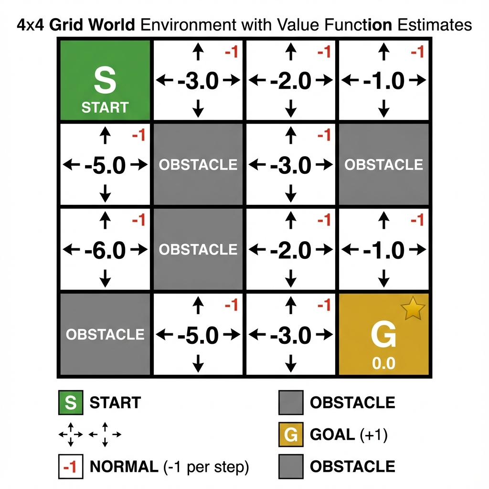
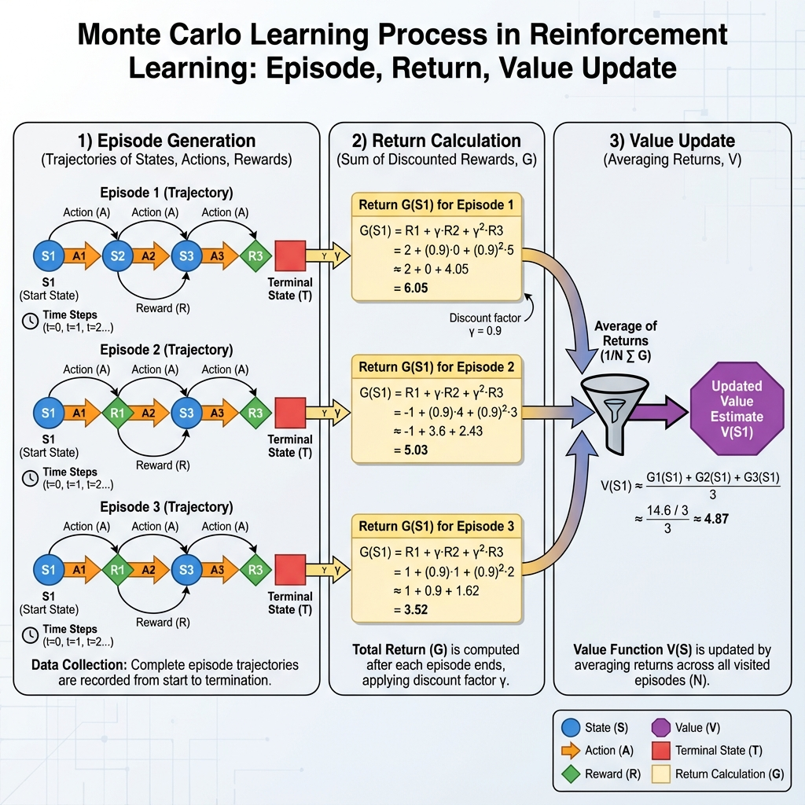

# MODULE 2: TABULAR SOLUTION METHODS

## 7 Hours

---

## Slide 31: Module 2 Overview

# Module 2: Tabular Solution Methods

### Topics Covered:

- Finite Markov Decision Processes (MDPs)
- Optimal Policies and Optimal Value Functions
- Dynamic Programming and its Efficiency
- Monte Carlo Methods
- Monte Carlo Prediction & Control

### Duration: 7 Hours

**Speaker Notes:**
Module 2 introduces formal frameworks and algorithms for solving RL problems with finite state spaces. We'll cover Markov Decision Processes which provide the mathematical foundation, Dynamic Programming for computing optimal solutions when the model is known, and Monte Carlo methods for learning from experience without a model. These tabular methods apply when we can enumerate all states and maintain value tables.

---

## Slide 32: Finite Markov Decision Processes (MDPs)

### MDP: The Mathematical Framework for RL



**Definition:** A Markov Decision Process is a tuple (S, A, P, R, γ)

- **S**: Set of states
- **A**: Set of actions
- **P**: State transition probability P(s'|s,a)
- **R**: Reward function R(s,a,s')
- **γ**: Discount factor γ ∈ [0,1]

**Speaker Notes:**
The MDP is the standard formalization of sequential decision making. It provides the mathematical foundation for most of RL. An MDP consists of states (all possible situations), actions (choices available), transition dynamics (how actions change states), rewards (immediate feedback), and a discount factor (preference for immediate vs future rewards). The diagram shows a simple MDP with states and transition probabilities.

---

## Slide 33: The Markov Property

### Why "Markov"?

**Markov Property:**

> The future is independent of the past given the present

**Mathematically:**

```
P(S_{t+1} | S_t, A_t, S_{t-1}, A_{t-1}, ..., S_0, A_0) = P(S_{t+1} | S_t, A_t)
```

**What it means:**

- Current state captures all relevant information
- Don't need history if we have current state
- State is a sufficient statistic for the future

**Examples:**

- **Markovian:** Chess board position (contains all needed information)
- **Non-Markovian:** Single frame from a video game (may need past frames for velocity)

**Practical Note:**
Many real problems aren't strictly Markov, but we can often make them Markov by augmenting the state with relevant history.

**Speaker Notes:**
The Markov property states that the current state contains all relevant information needed to predict the future—we don't need the complete history. This is crucial because it dramatically simplifies the mathematics. In chess, the current board position tells us everything we need; we don't need to know how we got there. However, in video games, a single frame might not be Markovian because we can't determine velocity. We solve this by stacking several recent frames together to form a Mar kovian state.

---

## Slide 34: Returns and Episodes

### Defining the Objective

**Return G_t:** Sum of (discounted) rewards from time t

**Episodic Tasks:**

```
G_t = R_{t+1} + γR_{t+2} + γ²R_{t+3} + ... + γ^{T-t-1}R_T
```

- Episodes terminate at step T
- Examples: Games, robot reaching goal

**Continuing Tasks:**

```
G_t = R_{t+1} + γR_{t+2} + γ²R_{t+3} + ... = Σ_{k=0}^∞ γ^k R_{t+k+1}
```

- Never terminate
- Examples: Stock trading, process control

**Discount Factor γ:**

- γ = 0: Only immediate reward matters (myopic)
- γ → 1: Future rewards matter nearly as much as immediate
- γ < 1 ensures infinite sums converge

**Speaker Notes:**
The return is the total reward we accumulate, possibly discounted. Episodic tasks have a natural end point—a game ends, a robot reaches its goal. Continuing tasks run forever. The discount factor γ serves two purposes: mathematical (makes infinite sums converge) and behavioral (models preference for immediate rewards). With γ=0, the agent is myopic and only cares about immediate reward. With γ near 1, the agent is far-sighted.

---

## Slide 35: Policies and Value Functions

### Core Concepts

**Policy π(a|s):**
Probability of taking action a in state s

**State-Value Function V^π(s):**

```
V^π(s) = E_π[G_t | S_t = s]
        = E_π[Σ_{k=0}^∞ γ^k R_{t+k+1} | S_t = s]
```

**Action-Value Function Q^π(s,a):**

```
Q^π(s,a) = E_π[G_t | S_t = s, A_t = a]
         = E_π[Σ_{k=0}^∞ γ^k R_{t+k+1} | S_t = s, A_t = a]
```

**Relationship:**

```
V^π(s) = Σ_a π(a|s) Q^π(s,a)
```

**Speaker Notes:**
A policy defines the agent's behavior—the probability of each action in each state. The state-value function V tells us how good it is to be in a state under policy π. The action-value function Q tells us how good it is to take action a in state s under policy π. These are expectations over possible futures. V and Q are related: the value of a state is the expected Q-value of the actions you might take from that state.

---

## Slide 36: Bellman Equations

### Recursive Relationship



**Bellman Equation for V^π:**

```
V^π(s) = Σ_a π(a|s) Σ_{s'} P(s'|s,a)[R(s,a,s') + γV^π(s')]
```

**Bellman Equation for Q^π:**

```
Q^π(s,a) = Σ_{s'} P(s'|s,a)[R(s,a,s') + γΣ_{a'} π(a'|s')Q^π(s',a')]
```

**Intuition:**
Value of current state = Immediate reward + Discounted value of next state

**Speaker Notes:**
The Bellman equation is fundamental to RL. It expresses values recursively: the value of being in states equals the expected immediate reward plus the discounted value of where you'll end up. This breaks the problem of computing long-term value into one-step dynamics. All RL algorithms are essentially trying to satisfy or approximate these equations. The diagram shows how value propagates backward from future states.

---

## Slide 37: Optimal Policies and Values

### The Goal of RL

**Optimal State-Value Function:**

```
V*(s) = max_π V^π(s) for all s ∈ S
```

**Optimal Action-Value Function:**

```
Q*(s,a) = max_π Q^π(s,a) for all s ∈ S, a ∈ A
```

**Optimal Policy:**
A policy π* is optimal if V^{π*}(s) = V*(s) for all states

**Bellman Optimality Equation for V*:**

```
V*(s) = max_a Σ_{s'} P(s'|s,a)[R(s,a,s') + γV*(s')]
```

**Bellman Optimality Equation for Q*:**

```
Q*(s,a) = Σ_{s'} P(s'|s,a)[R(s,a,s') + γ max_{a'} Q*(s',a')]
```

**Speaker Notes:**
The optimal value functions V* and Q* represent the best possible values achievable by any policy. An optimal policy achieves these values. The Bellman optimality equations replace the expectation over actions with a max—we select the best action rather than following a fixed policy. If we can solve for V* or Q*, we can easily derive an optimal policy: in each state, select the action with highest Q*.

---

## Slide 38: Extracting Policy from Values

### From Values to Actions

**Given V* (and model P,R):**

```
π*(s) = argmax_a Σ_{s'} P(s'|s,a)[R(s,a,s') + γV*(s')]
```

(Need model to look ahead one step)

**Given Q*:**

```
π*(s) = argmax_a Q*(s,a)
```

(No model needed!)

**Why Q is Useful:**

- Can derive optimal policy without environment model
- Just pick action with highest Q-value
- This is why many algorithms learn Q rather than V

**Example:** Grid World

- If we know Q*(s, "up") = 5, Q*(s, "down") = 3, Q*(s, "left") = 4, Q*(s, "right") = 6
- Optimal action in state s is "right"

**Speaker Notes:**
Once we have optimal values, extracting an optimal policy is straightforward. With V*, we need to model to do a one-step lookahead. With Q*, it's even easier—just pick the action with the highest Q-value. This is why Q-learning and related algorithms that learn Q are so popular. They enable optimal behavior without needing a model of the environment. Many modern RL algorithms focus on learning Q*.

---

## Slide 39: Dynamic Programming Introduction

### Solving MDPs When Model is Known

**Dynamic Programming (DP):**

- Family of algorithms for computing optimal policies
- Requires complete knowledge of MDP (P and R)
- Uses Bellman equations as update rules
- Bootstraps: Updates values based on other value estimates

**Key Algorithms:**


 **Policy Iteration:** Alternate between evaluation and improvement
3. **Value Iteration:** Directly compute V*

**Advantages:**

- Guaranteed to find optimal policy (if model is accurate)
- Efficient compared to exhaustive search

**Limitations:**

- Requires complete model of environment
- Computationally expensive for large state spaces
- Not applicable when model is unknown

**Speaker Notes:**
Dynamic Programming provides exact solutions to MDPs when we know the model. DP uses the Bellman equations as updates, improving value estimates iteratively. The term "programming" here refers to optimization (Bellman's original usage), not computer programming. DP is the foundation for many RL algorithms—even model-free methods use similar update structures. The limitation is that DP requires knowing P and R exactly, which is often unrealistic. However, understanding DP is crucial for understanding modern RL.

---

## Slide 40: Policy Evaluation (Prediction)

### Computing V^π for a Given Policy

**Problem:** Given policy π, compute its value function V^π

**Iterative Policy Evaluation Algorithm:**

```
Initialize V(s) = 0 for all s ∈ S
Repeat:
    Δ ← 0
    For each s ∈ S:
        v ← V(s)
        V(s) ← Σ_a π(a|s) Σ_{s'} P(s'|s,a)[R(s,a,s') + γV(s')]
        Δ ← max(Δ, |v - V(s)|)
Until Δ < θ (small threshold)
```

**Update Rule (Bellman backup):**

```
V_{k+1}(s) = Σ_a π(a|s) Σ_{s'} P(s'|s,a)[R(s,a,s') + γV_k(s')]
```

**Convergence:**
As k → ∞, V_k → V^π (guaranteed)

**Speaker Notes:**
Policy evaluation computes how good a given policy is. We iteratively apply the Bellman equation for V^π as an update rule. Initialize all values to zero (or randomly), then repeatedly update each state's value based on its expected immediate reward plus discounted next-state values. This process provably converges to the true V^π. The algorithm sweeps through all states, updating each one. Convergence is guaranteed because the updates are contractions under the max norm.

---

## Slide 41: Policy Improvement

### Making the Policy Better

**Policy Improvement Theorem:**
Given policy π and its value function V^π, if we define new policy π':

```
π'(s) = argmax_a Σ_{s'} P(s'|s,a)[R(s,a,s') + γV^π(s')]
```

Then V^{π'}(s) ≥ V^π(s) for all s (π' is at least as good as π)

**Greedy Policy Improvement:**
Make policy greedy with respect to current value function

**Process:**


 Improve policy by making it greedy w.r.t. V^π
3. If policy doesn't change, it's optimal!

**Speaker Notes:**
Policy improvement makes a policy better by making it greedy with respect to its value function. The policy improvement theorem guarantees this produces a better (or equally good) policy. The idea is simple: in each state, instead of following the current policy, select the action that looks best according to one-step lookahead using current values. If this process doesn't change the policy, we've found an optimal policy. This forms the basis of policy iteration.

---

## Slide 42: Policy Iteration

### Iterative Improvement to Optimality



**Algorithm:**

```

 Repeat:
     a) Policy Evaluation: Compute V^π
     b) Policy Improvement: π ← greedy(V^π)
   Until π doesn't change
3. Return π (optimal policy)
```

**Properties:**

- Each iteration improves policy (or keeps it same)
- Converges to optimal policy π* in finite iterations
- Number of iterations typically much less than |S|

**Computational Cost:**

- Each iteration: O(|S|²|A|) for evaluation
- Usually converges in few iterations

**Speaker Notes:**
Policy iteration alternates between evaluating the current policy and improving it. We start with any policy (often random), evaluate it to get V^π, improve it by making it greedy, evaluate the new policy, improve again, and so on. Because there are finitely many deterministic policies and each iteration improves the policy, we must eventually converge to an optimal policy. In practice, policy iteration often converges very quickly—often in surprisingly few iterations even for large state spaces.

---

## Slide 43: Value Iteration

### Direct Computation of V*

**Idea:** Combine evaluation and improvement into single update

**Value Iteration Algorithm:**

```
Initialize V(s) = 0 for all s ∈ S
Repeat:
    Δ ← 0
    For each s ∈ S:
        v ← V(s)
        V(s) ← max_a Σ_{s'} P(s'|s,a)[R(s,a,s') + γV(s')]
        Δ ← max(Δ, |v - V(s)|)
Until Δ < θ
Extract optimal policy: π(s) = argmax_a Σ_{s'} P(s'|s,a)[R(s,a,s') + γV(s')]
```

**Key Difference from Policy Iteration:**

- Uses Bellman optimality equation (max) instead of Bellman equation (expectation)
- No explicit policy during iteration
- Extract policy only at the end

**Convergence:**
V → V* as k → ∞

**Speaker Notes:**
Value iteration is simpler than policy iteration—there's no explicit policy until the end. We directly iterate on the Bellman optimality equation, updating each state's value to be the max over actions of expected return. This combines the evaluation and improvement steps of policy iteration into a single update. Once values converge to V*, we extract the optimal policy by acting greedily. Value iteration is often preferred in practice because it's simpler to implement and doesn't require complete policy evaluation at each step.

---

## Slide 44: DP Efficiency and Limitations

### Computational Considerations

**Efficiency Compared to Alternatives:**

- Exhaustive search: Exponential in horizon O(|A|^T)
- Linear programming: Polynomial but high degree O(|S|³)
- DP: Polynomial per iteration, quick convergence

**Computational Complexity:**

- Storage: O(|S|) for value function
- Per iteration: O(|S|²|A|) time
- Total: Depends on convergence rate

**The Curse of Dimensionality:**

- Number of states often exponential in problem dimension
- 10 boolean variables → 2^10 = 1024 states
- 10 variables with 10 values each → 10^10 states
- Tabular DP impractical for state spaces > ~1 million states

**Limitations:**


 Doesn't scale to large state spaces
3. Doesn't scale to continuous states

**Speaker Notes:**
While DP is efficient compared to naive approaches, it faces the curse of dimensionality. For small MDPs with thousands of states, DP works great. But real-world problems often have billions of states or continuous state spaces. We need alternatives: function approximation to represent values with fewer parameters, model-free methods that don't require knowing P and R, and sampling methods that don't require sweeping all states. These motivate the rest of the course.

---

## Slide 45: Grid World Example

### Applying DP to Grid World



**Setup:**

- 4×4 grid of states
- Actions: up, down, left, right
- Deterministic transitions (or stochastic with wind)
- Reward: -1 per step until goal
- Goal: Reach terminal state

**After Value Iteration:**

- Values decrease with distance from goal
- Optimal policy: Move toward goal
- Can visualize values and policy on grid

**Insights:**

- DP efficiently finds optimal policy
- Values show "distance" from goal
- Can handle stochastic transitions easily

**Speaker Notes:**
Grid World is a classic RL benchmark. The diagram shows states with their computed values. States closer to the goal have higher values (less negative). The optimal policy is to move toward the goal via the shortest path. This example demonstrates how DP computes values and policies. Even though it's simple, Grid World illustrates all the key concepts. In the lab, students will implement DP algorithms on Grid World.

---

## Slide 46: Monte Carlo Methods - Introduction

### Learning from Experience

**Key Idea:** Learn directly from episodes of experience without model

**Difference from DP:**

- **DP:** Requires model, bootstraps (uses value estimates)
- **MC:** No model needed, learns from complete episodes

**Monte Carlo Approach:**


 Observe returns from each state
3. Estimate values as average of observed returns

**Requirements:**

- Episodic tasks (episodes must terminate)
- Can learn from actual or simulated experience

**Advantages:**

- No model required
- Simple conceptually
- Can learn from subset of states (don't need full sweeps)

**Speaker Notes:**
Monte Carlo methods learn from experience rather than model-based computation. Instead of using the Bellman equation, MC methods simply average observed returns. If we want to know V^π(s), we visit state s many times following policy π, observe the return each time, and average those returns. This is pure empirical averaging—no bootstrapping, no model needed. MC methods require episodic tasks because we need complete returns. They're especially useful when we don't have a model or when the model is too complex.

---

## Slide 47: Monte Carlo Prediction

### Estimating V^π



**First-Visit MC Prediction:**

```
Initialize V(s) = 0 and Returns(s) = empty list for all s
Repeat forever:
    Generate episode following π
    For each state s appearing in episode:
        G ← return following first visit to s
        Append G to Returns(s)
        V(s) ← average(Returns(s))
```

**Every-Visit MC:**
Similar, but average returns from all visits, not just first

**Convergence:**
V(s) → V^π(s) as number of visits to s → ∞

**Speaker Notes:**
MC prediction estimates V^π by averaging observed returns. First-visit MC only uses the return from the first time a state is visited in an episode. Every-visit MC uses all visits. Both converge to the true V^π. The diagram shows how we generate episodes, calculate returns, and update estimates. MC is unbiased and doesn't bootstrap—each estimate is independent of others. This can be both an advantage (no bias from incorrect initial estimates) and disadvantage (slower learning than bootstrapping methods).

---

## Slide 48: Monte Carlo Estimation of Q

### Action-Value Estimation

**Problem:** Need Q^π(s,a), not just V^π(s) for control

**MC Estimation of Q:**
Average returns from state-action pairs (s,a)

**Challenge: Exploration**

- Need to visit all state-action pairs
- If policy is deterministic, many pairs never visited
- Solution: Exploring starts or ε-greedy policies

**Exploring Starts:**

- Ensure all (s,a) pairs have non-zero probability of being selected at episode start
- Unrealistic in practice

**ε-Greedy Policies:**

- With probability ε: select random action
- With probability 1-ε: select best action
- Ensures all actions tried infinitely often

**Speaker Notes:**
For control, we need Q-values, not V-values. We estimate Q^π(s,a) by averaging returns from (s,a) pairs. The key challenge is exploration—we must visit all state-action pairs to learn their values. If we always act greedily, we'll never try actions that look suboptimal initially but might actually be better. Exploring starts assumes we can start episodes from any (s,a) pair—unrealistic. ε-greedy is more practical: most of the time act optimally, occasionally explore randomly.

---

## Slide 49: Monte Carlo Control

### Monte Carlo for Finding Optimal Policies

**MC Control Algorithm (with ε-greedy):**

```
Initialize Q(s,a) arbitrarily, π = ε-greedy based on Q
Repeat forever:
    Generate episode using π
    For each (s,a) pair in episode:
        G ← return following (s,a)
        Q(s,a) ← average of returns from (s,a)
    For each s in episode:
        π(s) ← ε-greedy with respect to Q
```

**Key Properties:**

- On-policy: Evaluate and improve the policy being used to generate behavior
- Uses ε-greedy for exploration
- Converges to optimal ε-greedy policy

**Optimization:**

- Can update Q incrementally: Q ← Q + α[G - Q]
- Can use importance sampling for off-policy learning

**Speaker Notes:**
MC control finds optimal policies by alternating episode generation and policy improvement. After each episode, we update Q-values for visited (s,a) pairs, then improve the policy to be ε-greedy with respect to the new Q-values. This is on-policy learning—we evaluate and improve the same policy we're using to generate behavior. With ε-greedy, the policy is always stochastic (never fully deterministic), ensuring continued exploration. This algorithm converges to the optimal ε-greedy policy.

---

## Slide 50: Monte Carlo vs DP

### Comparison

| Aspect                  | Dynamic Programming            | Monte Carlo                 |
| ----------------------- | ------------------------------ | --------------------------- |
| **Model**         | Required (P, R)                | Not required                |
| **Bootstrapping** | Yes (use estimates)            | No (use actual returns)     |
| **Episodes**      | Not required                   | Required (episodic tasks)   |
| **State Space**   | All states updated             | Only visited states updated |
| **Convergence**   | Faster (bootstrapping)         | Slower but unbiased         |
| **Bias**          | Initial values affect learning | Unbiased estimates          |
| **Variance**      | Low (one-step)                 | High (full returns)         |
| **Computation**   | Sweep all states               | Sample episodes             |

**When to Use Each:**

- **DP:** Model available, small-medium state space, need fast convergence
- **MC:** No model, large state space, can afford many episodes, episodic tasks

**Speaker Notes:**
DP and MC represent different paradigms. DP requires a model and uses bootstrapping for efficiency. MC learns from experience without a model. DP's bootstrapping makes it faster but biased by initial estimates. MC is unbiased but has high variance because returns depend on many random events. DP must sweep all states; MC can focus on visited states. In practice, temporal difference methods (next module) combine advantages of both—bootstrapping like DP but model-free like MC.

---

## Slide 51: Module 2 Summary

### Key Takeaways

**Markov Decision Processes:**

- Formal framework: (S, A, P, R, γ)
- Markov property: future independent of past given present
- Bellman equations express values recursively

**Optimal Values and Policies:**

- V*(s), Q*(s,a): best achievable values
- Bellman optimality equations
- Optimal policy: greedy with respect to V* or Q*

**Dynamic Programming:**

- Policy evaluation, policy iteration, value iteration
- Requires model, guarantees optimality
- Curse of dimensionality limits scalability

**Monte Carlo Methods:**

- Learn from episodes of experience
- No model required
- Unbiased but high variance
- Requires episodic tasks

**Speaker Notes:**
This module introduced the mathematical foundations of RL. MDPs formalize sequential decision problems. The Bellman equations express the recursive structure of values. We explored two families of solution methods: Dynamic Programming (model-based, efficient, guaranteed optimal) and Monte Carlo (model-free, simple, episodic). These methods handle small, finite state spaces. The next module introduces temporal difference learning, which combines advantages of DP and MC.

---

## Slide 52: Module 2 - Review Questions

### Test Your Understanding

**Question 1:** What does the Markov property state?
a) The future is independent of the present given the past
b) The future is independent of the past given the present
c) All states are equally likely
d) Rewards must be positive

**Answer:** b) The future is independent of the past given the present

---

**Question 2:** Which method requires a complete model of the environment?
a) Monte Carlo
b) Q-Learning
c) Dynamic Programming
d) Policy Gradient

**Answer:** c) Dynamic Programming

---

**Question 3:** What is the main advantage of Monte Carlo methods over Dynamic Programming?
a) Faster convergence
b) No model required
c) Lower variance
d) Works with continuing tasks

**Answer:** b) No model required

---

**Question 4:** In the Bellman optimality equation for V*, we take the ____ over actions.
a) sum
b) average
c) minimum
d) maximum

**Answer:** d) maximum

---

**Question 5:** Policy iteration alternates between which two steps?
a) Exploration and exploitation
b) Policy evaluation and policy improvement
c) On-policy and off-policy
d) Prediction and control

**Answer:** b) Policy evaluation and policy improvement

**Speaker Notes:**
These questions test understanding of Module 2 concepts. Question 1 addresses the fundamental Markov property. Question 2 distinguishes model-based vs model-free methods. Question 3 highlights MC's key advantage. Question 4 tests understanding of optimality equations. Question 5 covers the policy iteration algorithm. Students should be comfortable with all these concepts before proceeding.

---
