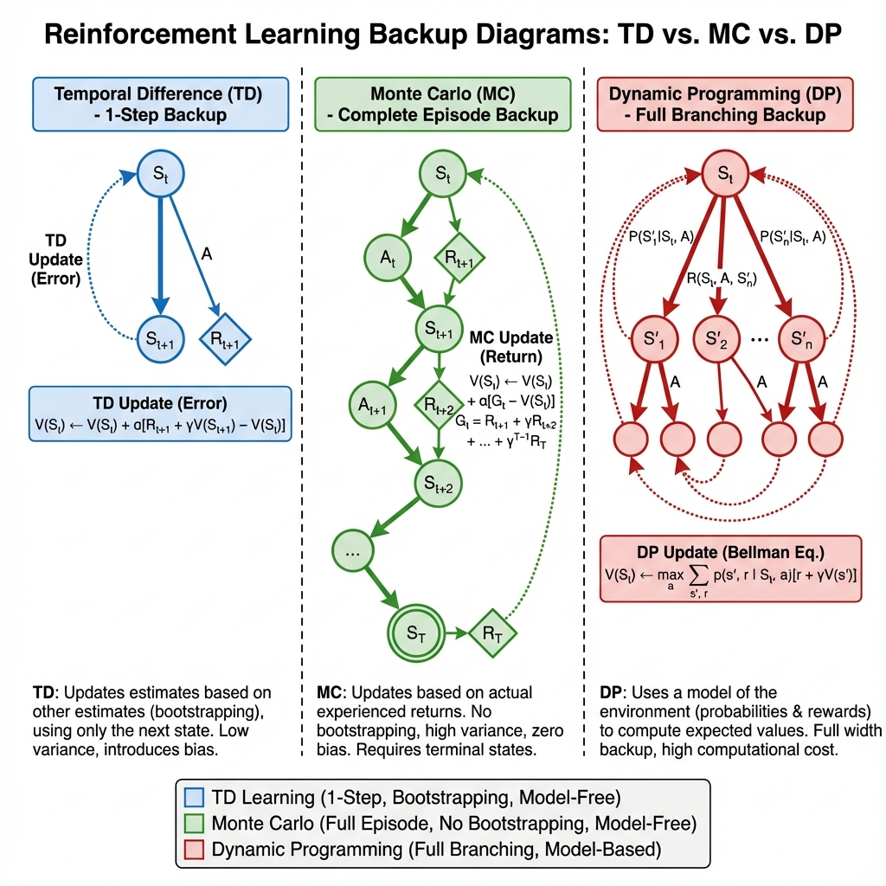
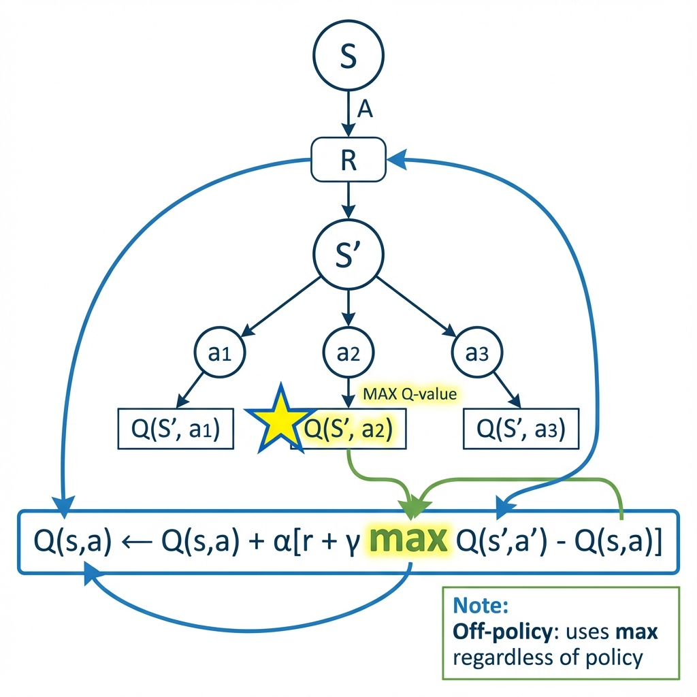
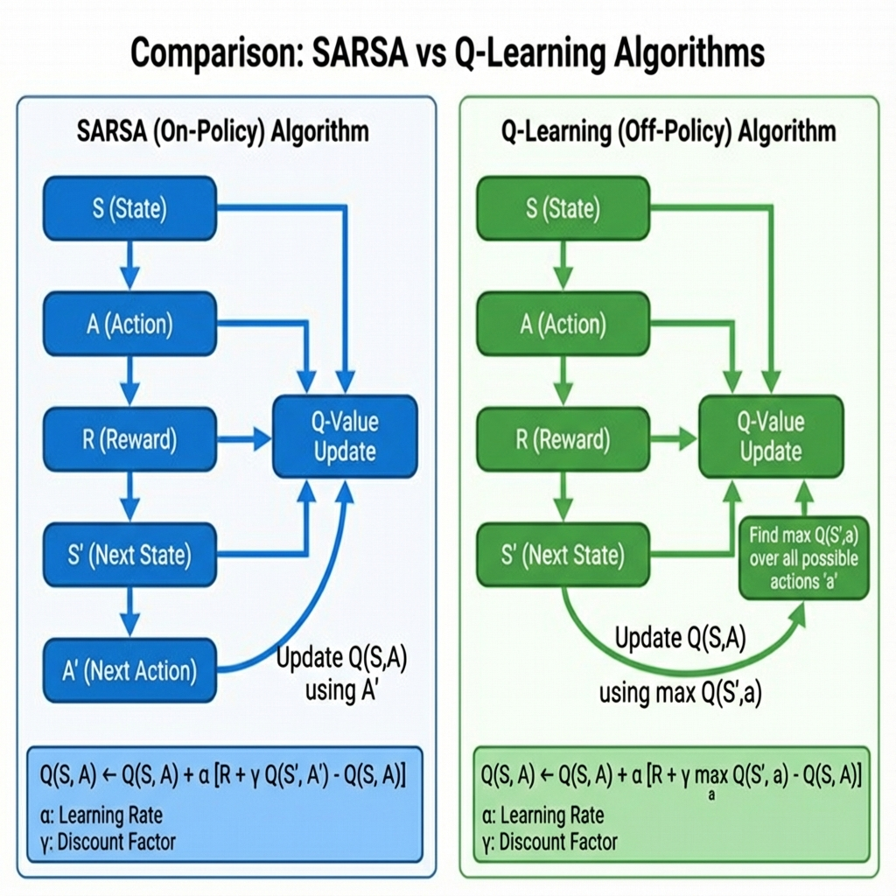
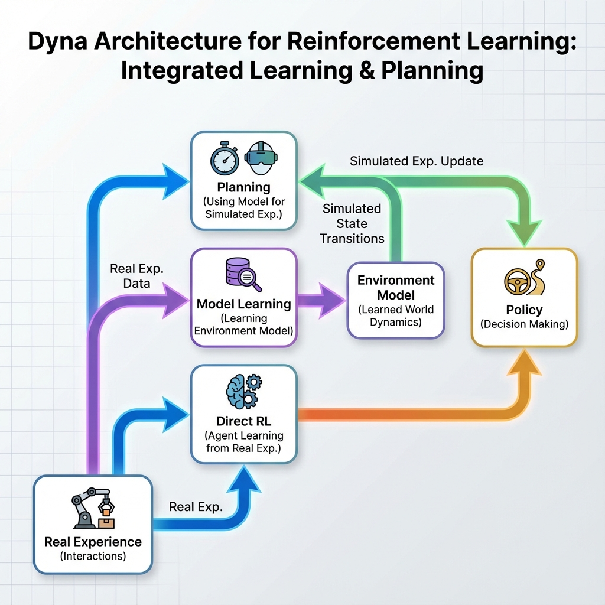
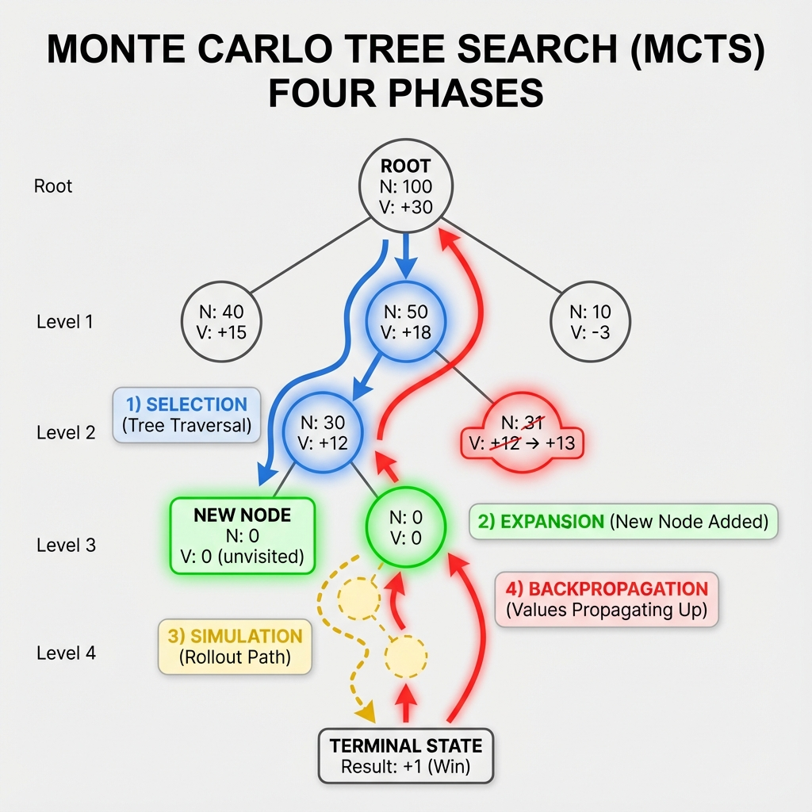

# MODULE 3: OTHER TABULAR METHODS, PLANNING & LEARNING
## 8 Hours

---

## Slide 53: Module 3 Overview

# Module 3: Other Tabular Methods, Planning & Learning

### Topics Covered:
- Temporal-Difference Learning
- TD Prediction, SARSA, Q-Learning
- n-step Bootstrapping
- Models and Planning
- Dyna: Integrated Planning, Acting, Learning
- Trajectory Sampling, Real-time DP
- Planning at Decision Time
- Monte Carlo Tree Search (MCTS)

### Duration: 8 Hours

**Speaker Notes:**
Module 3 introduces temporal difference learning, which combines the best of Monte Carlo and Dynamic Programming. We'll explore on-policy (SARSA) and off-policy (Q-Learning) TD control methods, then dive into planning methods that use models to improve sample efficiency. MCTS represents the state-of-the-art in game playing. This module bridges tabular methods and modern deep RL.

---

##Slide 54: Temporal-Difference Learning Introduction

### The Best of Both Worlds



**Key Idea:** Learn from incomplete episodes using bootstrapping

**TD combines advantages of:**

- **Monte Carlo:** Model-free, learn from experience
- **Dynamic Programming:** Bootstrap from estimates, learn before episode ends

**TD Update (TD(0)):**
```
V(S_t) ← V(S_t) + α[R_{t+1} + γV(S_{t+1}) - V(S_t)]
```

**TD Target:** R_{t+1} + γV(S_{t+1})  
**TD Error:** δ_t = R_{t+1} + γV(S_{t+1}) - V(S_t)

**Speaker Notes:**
Temporal Difference learning is arguably the most important idea in RL. Like Monte Carlo, TD learns directly from experience without a model. Like Dynamic Programming, TD bootstraps—it updates estimates based on other estimates. The TD update uses the observed reward plus the estimated value of the next state rather than waiting for the complete return. This enables learning from incomplete episodes and faster learning than MC.

---

## Slide 55: TD vs MC vs DP

### Comparison of Learning Methods

| **Aspect** | **TD** | **Monte Carlo** | **Dynamic Programming** |
|------------|--------|----------------|------------------------|
| **Model** | Not required | Not required | Required |
| **Bootstrapping** | Yes | No | Yes |
| **Episodes** | Online (every step) | Episodic only | N/A |
| **Bias** | Biased (from V estimates) | Unbiased | Biased (initialization) |
| **Variance** | Low (one-step) | High (full return) | Low |
| **Convergence Speed** | Fast | Slow | Fastest (with model) |
| **Update Target** | R + γV(S') | G_t (actual return) | Bellman equation backup |

**When to Use TD:**

- No model available
- Want faster learning than MC
- Online learning needed
- Continuing tasks

**Speaker Notes:**
TD occupies a sweet spot between MC and DP. It's model-free like MC but bootstraps like DP. TD has lower variance than MC because it uses one-step returns rather than noisy episodic returns. However, TD is biased because it relies on value estimates that may be incorrect initially. In practice, the variance reduction usually outweighs the bias, making TD faster than MC. TD works online—it learns after every step, not just at episode end.

---

## Slide 56: TD Prediction (TD(0))

### Learning V^π with TD

**TD(0) Prediction Algorithm:**
```
Initialize V(s) arbitrarily for all s ∈ S
Repeat (for each episode):
    Initialize S
    Repeat (for each step of episode):
        A ← action given by π for S
        Take action A, observe R, S'
        V(S) ← V(S) + α[R + γV(S') - V(S)]
        S ← S'
    Until S is terminal
```

**Advantages:**

- Updates immediately after each step
- No need to wait for episode termination
- Works with continuing tasks
- Lower variance than MC

**Convergence:**
V converges to V^π (under appropriate conditions on α)

**Speaker Notes:**
TD(0) is the simplest TD method—it updates after every single step. The "0" indicates it looks ahead one step (zero steps of delay). After taking action and observing reward and next state, we immediately update our value estimate for the current state. The update pushes the current estimate toward the observed reward plus our estimate of the next state's value. This runs fully online and doesn't require episode boundaries, making it suitable for continuing tasks.

---

## Slide 57: SARSA: On-Policy TD Control

### State-Action-Reward-State-Action

**SARSA Algorithm:**
```
Initialize Q(s,a) arbitrarily for all s,a
Repeat (for each episode):
    Initialize S
    Choose A from S using policy derived from Q (e.g., ε-greedy)
    Repeat (for each step):
        Take action A, observe R, S'
        Choose A' from S' using policy derived from Q
        Q(S,A) ← Q(S,A) + α[R + γQ(S',A') - Q(S,A)]
        S ← S'; A ← A'
    Until S is terminal
```

**Update Rule:**
```
Q(S_t,A_t) ← Q(S_t,A_t) + α[R_{t+1} + γQ(S_{t+1},A_{t+1}) - Q(S_t,A_t)]
```

**On-Policy:** Learns value of the policy being followed

**Name:** State-Action-Reward-State-Action (quintuple)

**Speaker Notes:**
SARSA is the TD version of Monte Carlo control. It learns Q-values using TD updates. The name comes from the quintuple (S,A,R,S',A') used in the update. Crucially, SARSA is on-policy—it evaluates and improves the same policy it's using to generate behavior. If using ε-greedy, SARSA learns the value of the ε-greedy policy. This makes SARSA safer for online learning—it takes into account the exploration in the policy.

---

## Slide 58: Q-Learning: Off-Policy TD Control

### Learning the Optimal Policy Directly

**Q-Learning Algorithm:**
```
Initialize Q(s,a) arbitrarily for all s,a  
Repeat (for each episode):
    Initialize S
    Repeat (for each step):
        Choose A from S using policy derived from Q (e.g., ε-greedy)
        Take action A, observe R, S'
        Q(S,A) ← Q(S,A) + α[R + γ max_a Q(S',a) - Q(S,A)]
        S ← S'
    Until S is terminal
```

**Update Rule:**
```
Q(S_t,A_t) ← Q(S_t,A_t) + α[R_{t+1} + γ max_a Q(S_{t+1},a) - Q(S_t,A_t)]
```

**Off-Policy:** Learns optimal Q* regardless of policy followed

**Key Difference:** Uses max instead of actual next action

**Q-Learning Backup Visualization:**



The diagram shows how Q-Learning backs up the maximum Q-value from the next state, regardless of which action the policy actually takes. This off-policy characteristic allows learning the optimal policy while exploring.

**Speaker Notes:**
Q-Learning is one of the most important algorithms in RL. Unlike SARSA, Q-Learning is off-policy—it learns the optimal Q* values regardless of which policy is being followed. The key is using max_a Q(S',a) in the update rather than Q(S',A'). This makes Q-Learning directly approximate Q* even while following an exploratory policy. Q-Learning can be more aggressive and data-efficient than SARSA, but can also be less stable because it's learning about a different policy than it's following. The backup diagram clearly shows this max operation.

---

## Slide 59: SARSA vs Q-Learning

### On-Policy vs Off-Policy



**SARSA (On-Policy):**

- ✓ Learns value of policy being followed
- ✓ More conservative, safer
- ✓ Takes exploration into account
- ✗ Learns sub-optimal policy if using ε-greedy

**Q-Learning (Off-Policy):**

- ✓ Learns optimal Q* directly
- ✓ More data-efficient
- ✓ Can learn from any behavior policy
- ✗ Can be less stable
- ✗ Doesn't account for exploration risk

**Classic Example: Cliff Walking**
- SARSA learns safer path away from cliff
- Q-Learning learns risky path close to cliff (optimal if executed perfectly)

**Speaker Notes:**
The diagram shows the key algorithmic difference. SARSA uses the actual next action A', while Q-Learning uses max. In the cliff walking problem, there's a path near a cliff edge that's shorter but risky. Q-Learning finds this optimal but dangerous path because it assumes perfect execution. SARSA, learning about its own ε-greedy behavior, chooses a longer but safer path that accounts for random exploration. The choice between them depends on whether you want to learn the optimal policy (Q-Learning) or the best policy you can safely execute given exploration (SARSA).

---

## Slide 60: Expected SARSA

### A Middle Ground

**Expected SARSA Update:**
```
Q(S,A) ← Q(S,A) + α[R + γ Σ_a π(a|S') Q(S',a) - Q(S,A)]
```

**Key Difference:**

- Uses expected value over next actions instead of sampled action
- Expectation weighted by policy π

**Properties:**

- More stable than SARSA (no sampling variance over A')
- If π is greedy, reduces to Q-Learning
- If π is ε-greedy, it's between SARSA and Q-Learning

**Advantages:**

- Less variance than SARSA
- More stable than Q-Learning
- Can be on-policy or off-policy

**Computational Cost:**

- Requires summing over all actions
- Only feasible for small action spaces

**Speaker Notes:**
Expected SARSA replaces the sample A' with an expectation over all possible next actions weighted by the policy. This eliminates the variance from randomly sampling the next action, making learning more stable. It's a strict generalization—with a greedy policy it becomes Q-Learning, with an ε-greedy policy it's similar to SARSA but with lower variance. The cost is computational: we must sum over all actions. In practice, Expected SARSA often performs better than both SARSA and Q-Learning.

---

## Slide 61: n-Step Bootstrapping

### Spectrum Between MC and TD

**n-Step Return:**
```
G_t^{(n)} = R_{t+1} + γR_{t+2} + ... + γ^{n-1}R_{t+n} + γ^n V(S_{t+n})
```

**n-Step TD Update:**
```
V(S_t) ← V(S_t) + α[G_t^{(n)} - V(S_t)]
```

**Special Cases:**

- n=1: TD(0) (one-step TD)
- n=∞: Monte Carlo

**n-Step SARSA:**
```
Q(S_t,A_t) ← Q(S_t,A_t) + α[G_t^{(n)} - Q(S_t,A_t)]
where G_t^{(n)} = R_{t+1} + γR_{t+2} + ... + γ^{n-1}R_{t+n} + γ^nQ(S_{t+n},A_{t+n})
```

**Trade-off:**

- Small n: Low variance, more bias
- Large n: High variance, less bias

**Speaker Notes:**
n-step methods generalize TD and MC. Instead of one-step lookahead (TD) or complete returns (MC), we look ahead n steps. This provides a spectrum of algorithms trading off bias and variance. Small n gives fast learning with some bias; larger n reduces bias but increases variance. The optimal n depends on the problem. n-step methods are particularly important in deep RL (as we'll see with A3C). In practice, n between 3-5 often works well.

---

## Slide 62: Models and Planning

### Using Models to Improve Sample Efficiency

**Model:** Anything the agent uses to predict environment responses

**Two Types:**

 **Sample Model:** Produces single samples from distributions

**Planning:** Using a model to improve policy before or between interactions

**Two Uses of Models:**

- **Learn model from experience, then plan with it** (model-based RL)
- **Use model for mental simulations** (planning)

**Value of Models:**

- Can generate synthetic experience
- Amortize real experience over many planning updates
- Enable thinking ahead before acting

**Speaker Notes:**
A model predicts what the environment will do. Models come in two flavors: distribution models give complete probability distributions (like the P matrix in MDPs), while sample models just generate individual samples. We can use models for planning—using simulated experience to improve our policy. This can be much more sample-efficient than model-free learning. Real interactions with the environment are often expensive; if we learn a model, we can think/plan using simulated experience without costly real interactions.

---

## Slide 63: Dyna: Integrated Planning, Acting, and Learning

### Combining Real and Simulated Experience



**Dyna-Q Algorithm:**
```
Initialize Q(s,a) and Model(s,a) for all s,a
Loop forever:
    (a) S ← current state
    (b) A ← ε-greedy(S, Q)
    (c) Execute A, observe R, S'
    (d) Q(S,A) ← Q(S,A) + α[R + γ max_a Q(S',a) - Q(S,A)]  // Direct RL
    (e) Model(S,A) ← R, S'  // Model learning
    (f) Repeat n times:  // Planning
        S_sim ← random previously observed state
        A_sim ← random action previously taken in S_sim
        R_sim, S'_sim ← Model(S_sim, A_sim)
        Q(S_sim,A_sim) ← Q(S_sim,A_sim) + α[R_sim + γ max_a Q(S'_sim,a) - Q(S_sim,A_sim)]
```

**Three Components:**

 **Model Learning:** Update model from real experience
3. **Planning:** Update Q using simulated experience from model

**Speaker Notes:**
Dyna seamlessly integrates learning and planning. After each real experience, Dyna: (1) uses it to directly update Q (model-free learning), (2) uses it to update the environment model, and (3) performs several planning updates using simulated experience from the model. This amplifies the value of each real experience. The agent learns both from reality and from simulated experience. Dyna can be much more sample-efficient than pure model-free methods. The planning parameter n controls how much planning per real step.

---

## Slide 64: Trajectory Sampling vs Exhaustive Sweeps

### Smart Planning

**Exhaustive Sweeps (DP):**

- Update all states uniformly
- Wastes computation on irrelevant states
- Necessary when no experience available

**Trajectory Sampling:**

- Sample states according to on-policy distribution
- Focus computation on states actually encountered
- More efficient when state space is large

**Benefits of Focused Updates:**

- Faster convergence on large problems
- Adapts to where agent actually goes
- Works well with function approximation

**Empirical Results:**
On large problems, trajectory sampling converges faster than uniform sweeps

**Speaker Notes:**
In Dynamic Programming, we sweep through all states uniformly. But many states might be irrelevant—states the agent never visits or are far from important decisions. Trajectory sampling focuses planning on states that matter by sampling them according to the distribution encountered when following the policy. This is much more efficient in large state spaces. Instead of wasting computation uniformly updating all states, we concentrate updates where they matter. This principle becomes even more important in function approximation and deep RL.

---

## Slide 65: Real-Time Dynamic Programming

### Planning Focused on Current State

**Key Idea:** Focus planning on relevant states as they're encountered

**RTDP Algorithm:**

- Maintain Q-values or V-values
- When visiting state s, update s and sample from successors
- Asynchronous value iteration focused on current trajectory

**Properties:**

- Guarantees convergence to optimal if all states visited infinitely often
- Much faster than uniform sweeps in practice
- Works well in large state spaces
- Naturally focuses computation on reachable states

**Relationship to Other Methods:**

- Like Dyna but focuses on current trajectory
- Like value iteration but asynchronous
- Motivated trajectory sampling

**Speaker Notes:**
Real-Time Dynamic Programming performs value iteration updates focused on states along the current trajectory and their likely successors. Instead of sweeping all states, RTDP concentrates computation on states that matter right now. This is valuable in large state spaces where exhaustive sweeps are impractical. RazorTDP maintains the convergence guarantees of DP while being much faster in practice. It's an early example of the principle that we should focus learning/planning where it matters, not uniformly everywhere.

---

## Slide 66: Planning at Decision Time

### Think Before You Act

**Two Planning Paradigms:**

**1. Background Planning (e.g., Dyna):**

- Plan continuously in background
- Use result to maintain policy/values
- Act quickly using stored knowledge

**2. Decision-Time Planning:**

- Plan only when decision is needed
- Focus all planning on current state
- Afterwards, discard planning results

**Decision-Time Example:**

- **Heuristic Search:** Search forward from current state
- **Monte Carlo Tree Search:** Build search tree, simulate futures

**Trade-offs:**

- Decision-time: Focused but computationally demanding per decision
- Background: Pre-computed responses, fast acting, but may waste planning

**Speaker Notes:**
There are two ways to use planning. Background planning (like Dyna) happens continuously to build and maintain a good policy. When a decision is needed, we simply look up the pre-computed answer. Decision-time planning waits until a decision is needed, then focuses all planning on the current state, exploring what might happen from here. Afterwards, we throw away the planning results. Game-playing programs often use decision-time planning—when it's your turn, you simulate many possible future games from the current position. The next slides cover MCTS, the most successful decision-time planning method.

---

## Slide 67: Monte Carlo Tree Search (MCTS) Introduction

### State-of-the-Art Game Playing



**Key Idea:** Build a search tree incrementally using Monte Carlo simulation

**Four Phases (repeated many times):**

 **Expansion:** Add new node to tree

 **Backpropagation:** Update values along path

**UCB Tree Policy:**
```
Select child a_i that maximizes: Q(s,a_i) + c√(ln N(s)/N(s,a_i))
```
- Balances exploitation (Q-value) and exploration (visit counts)
- **c** controls exploration level

**Speaker Notes:**
MCTS is the leading algorithm for game playing, powering AlphaGo and others. Unlike minimax search, MCTS builds the search tree adaptively, focusing on promising regions. The algorithm repeats four phases: selection traverses the partial tree using UCB to balance exploration and exploitation; expansion adds a new leaf; simulation runs a rollout to a terminal state; backpropagation updates statistics. After many iterations, MCTS has built a sophisticated search tree. We then select the action with the best statistics. MCTS handles huge branching factors and doesn't require a heuristic evaluation function.

---

## Slide 68: MCTS: Upper Confidence Bounds (UCB)

### Balancing Exploration and Exploitation

**UCB1 Formula:**
```
a* = argmax_a [Q(s,a) + c√(ln N(s)/N(s,a))]
```

**Components:**

- **Q(s,a):** Average value from action a (exploitation)
- **c√(ln N(s)/N(s,a)):** Exploration bonus (exploration)
- **N(s):** Number of times parent visited
- **N(s,a):** Number of times action a visited

**How it Works:**

- Actions with high Q-value: More likely selected (exploitation)
- Actions with few visits: Get exploration bonus (exploration)
- Bonus decreases with visits
- All actions tried infinitely often (theoretical guarantee)

**Tuning c:**

- Larger c: More exploration
- Smaller c: More exploitation
- √2 is theoretical optimum for multi-armed bandits

**Speaker Notes:**
The UCB formula is crucial to MCTS success. It solves the exploration-exploitation dilemma elegantly. The first term exploits—select actions with high average value. The second term explores—actions visited rarely get a bonus inversely proportional to their visit count. As we visit an action more, its exploration bonus shrinks. This ensures all actions are tried, but promising actions get more attention. The logarithm of parent visits in the numerator means exploration rate decreases as we get more total samples. UCB has theoretical guarantees for bandits and works excellently in practice for tree search.

---

## Slide 69: MCTS Simulation (Rollout)

### From Tree Leaf to Terminal State

**Rollout Policy:**

- Simple policy used to complete episode from tree leaf
- Often random or domain-specific heuristic
- Doesn't need to be optimal, just reasonable

**Full Episode Value:**
Each MCTS iteration simulates complete game from current position to end

**Backpropagation:**

- Final outcome propagated back up tree
- Update visit counts and average values
- All nodes along path updated

**Why Rollouts Work:**

- Gives noisy but unbiased value estimates
- Many rollouts average out noise
- Better than no lookahead

**Default Policies:**

- Games: Random or simple heuristic moves
- Go: Local pattern-based moves
- AlphaGo: Uses neural network policy

**Speaker Notes:**
After selecting and expanding, we need to evaluate the new leaf node. MCTS runs a simulation (rollout) from the leaf to a terminal state using a rollout policy. This policy should be fast—we need many rollouts. Random often works, but domain knowledge helps. In Go, random plays poorly; AlphaGo uses a learned neural network. The outcome (win/loss) is then backpropagated up the tree, updating visit counts and average values at all nodes along the path. Many rollouts from a node give a good estimate of its value.

---

## Slide 70: MCTS Applications and Success

### Real-World Impact

**Historic Success: AlphaGo**
- First to beat world champion at Go
- Combined MCTS with deep neural networks
- Revolutionized computer Go

**Why MCTS Excels:**

- Handles huge branching factors (Go: ~250 moves/position)
- Anytime algorithm: Improves with more time
- Asymmetric tree growth: Focuses on promising lines
- No need for heuristic evaluation function

**Applications Beyond Games:**

- Scheduling and planning problems
- Monte Carlo planning in robotics
- UCB bandit algorithms in general
- Real-time strategy games

**Limitations:**

- Requires fast simulation
- Works best with episodic tasks
- Can be slow for real-time decisions
- Performance depends on rollout policy quality

**Speaker Notes:**
MCTS transformed computer game playing, especially Go. Before MCTS, computer Go was weak because the branching factor is too large for traditional search and no good heuristic existed. MCTS solved both problems: adaptive tree growth focuses on promising moves, and rollouts eliminate the need for evaluation functions. AlphaGo combined MCTS with deep learning for historic success. MCTS's success extends beyond games to scheduling, planning, and decision-making under uncertainty. The key requirement is fast simulation—if we can simulate the domain quickly, MCTS can handle it.

---

## Slide 71: Module 3 Summary

### Key Takeaways

**Temporal Difference Learning:**

- Combines MC (model-free) and DP (bootstrapping)
- Updates after each step using TD target
- Lower variance than MC, works online

**TD Control Methods:**

- **SARSA:** On-policy, learns value of followed policy
- **Q-Learning:** Off-policy, learns optimal Q* directly
- **Expected SARSA:** More stable, between SARSA and Q-Learning

**n-Step Methods:**

- Spectrum between TD (n=1) and MC (n=∞)
- Trade-off bias vs variance

**Planning and Models:**

- **Dyna:** Integrates real and simulated experience
- **Trajectory Sampling:** Focus planning on relevant states
- **MCTS:** Decision-time planning for games

**Speaker Notes:**
This module introduced temporal difference learning, arguably the most important idea in modern RL. TD methods combine the best aspects of MC and DP—model-free but bootstrapping for efficiency. SARSA and Q-Learning are workhorse algorithms for tabular RL. Planning methods like Dyna show how models can amplify learning from limited experience. MCTS demonstrates decision-time planning's power in game domains. These methods scale up with function approximation (next module) and neural networks (later modules) to handle real-world complexity.

---

## Slide 72: Module 3 - Review Questions

### Test Your Understanding

**Question 1:** What is the key advantage of TD learning over Monte Carlo?
a) It requires a model
b) It can learn from incomplete episodes
c) It has zero bias
d) It requires less memory

**Answer:** b) It can learn from incomplete episodes

---

**Question 2:** Which algorithm is off-policy?
a) SARSA
b) Monte Carlo Control
c) Q-Learning
d) Policy Iteration

**Answer:** c) Q-Learning

---

**Question 3:** In Dyna-Q, what are the three main components?
a) Policy, Value, Model
b) Agent, Environment, Reward
c) Direct RL, Model Learning, Planning
d) Selection, Expansion, Simulation

**Answer:** c) Direct RL, Model Learning, Planning

---

**Question 4:** What does UCB stand for in MCTS?
a) Uniform Confidence Bounds
b) Upper Confidence Bounds
c) Universal Control Baseline
d) Updated Cost Bounds

**Answer:** b) Upper Confidence Bounds

---

**Question 5:** The main difference between SARSA and Q-Learning is:
a) SARSA uses TD, Q-Learning uses MC
b) SARSA is on-policy, Q-Learning is off-policy
c) SARSA needs a model, Q-Learning doesn't
d) SARSA maximizes reward, Q-Learning minimizes loss

**Answer:** b) SARSA is on-policy, Q-Learning is off-policy

**Speaker Notes:**
These questions test core Module 3 concepts. Question 1 addresses TD's key advantage. Question 2 distinguishes on-policy from off-policy. Question 3 covers Dyna's architecture. Question 4 tests MCTS terminology. Question 5 highlights the crucial SARSA vs Q-Learning distinction. Mastery of these concepts is essential for understanding modern RL algorithms.

---
