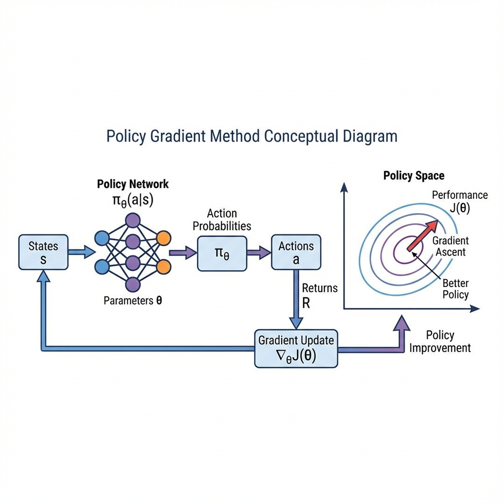
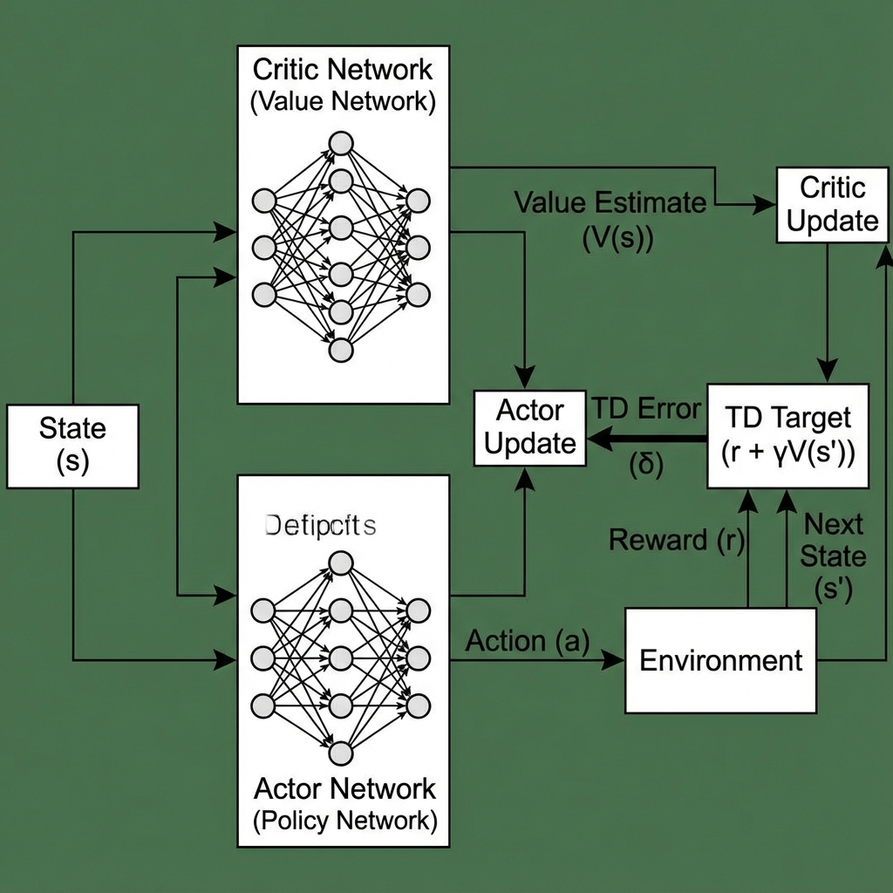
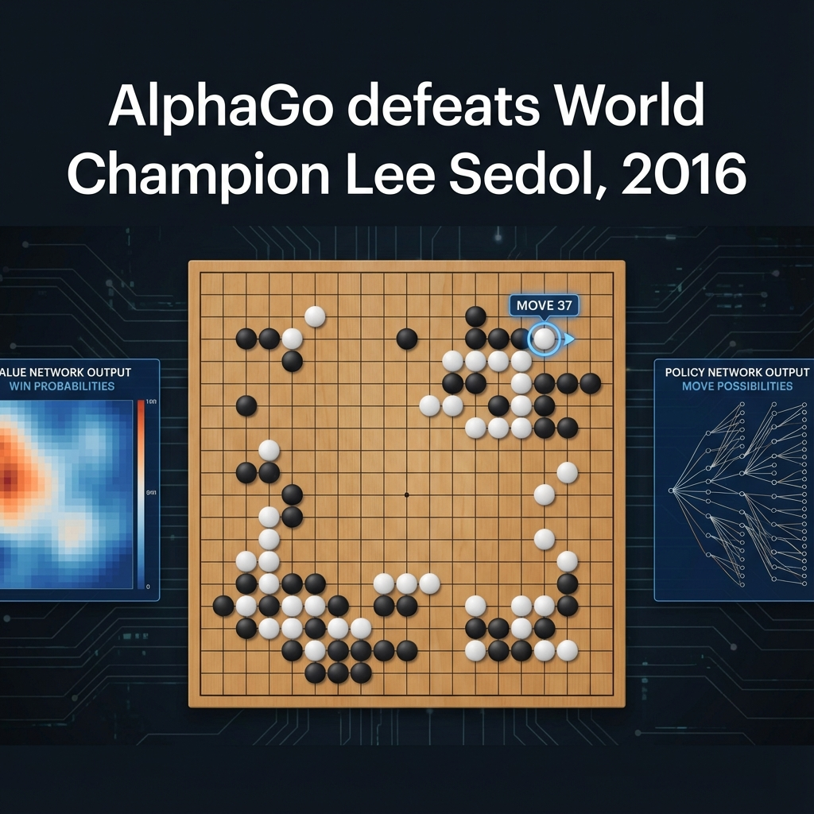
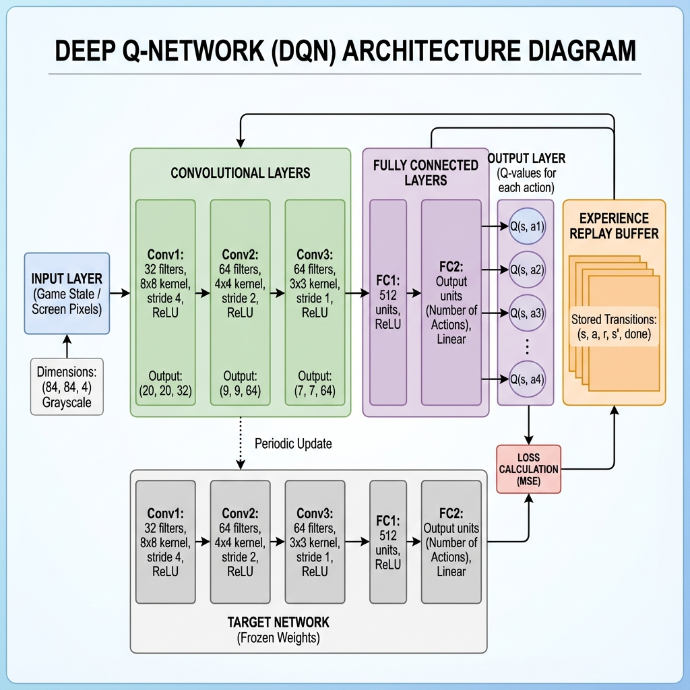
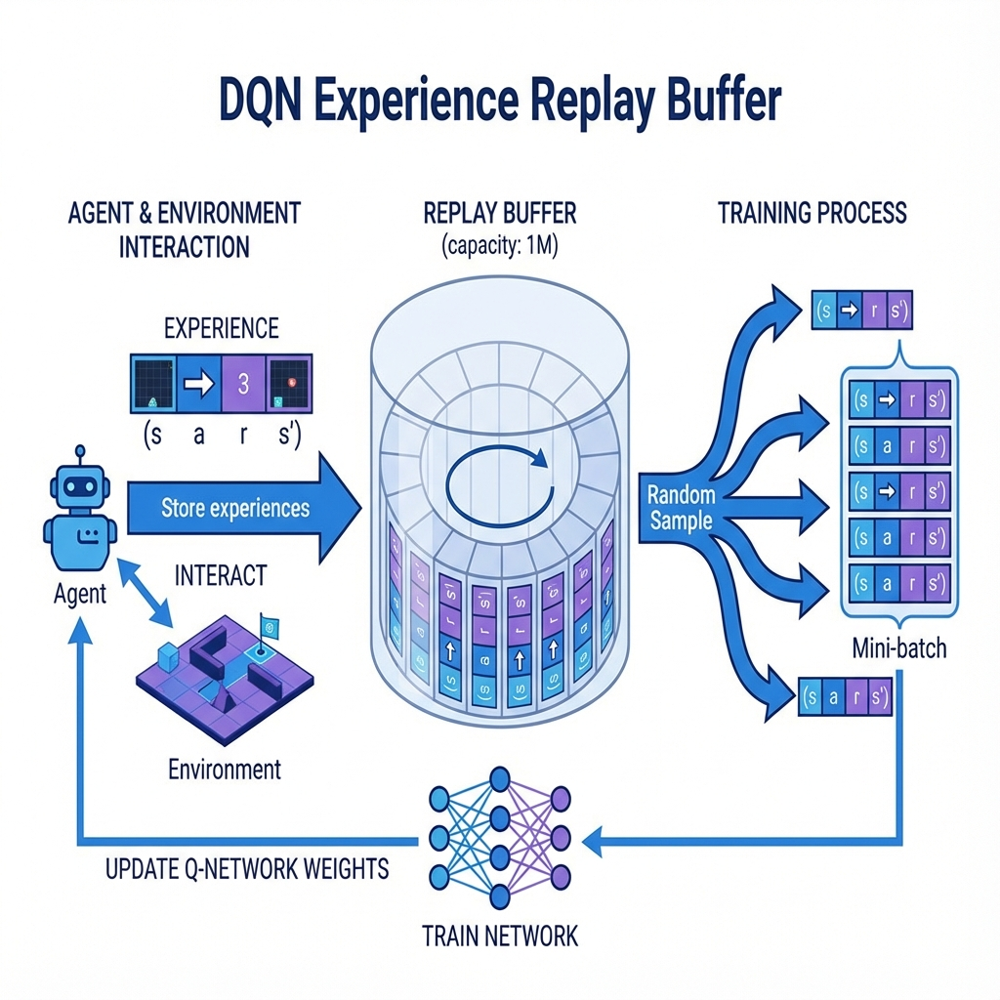

# MODULES 4-8, LABORATORIES, AND FINAL MATERIALS
# BCSE432E - Reinforcement Learning

---

# MODULE 4: APPROXIMATE SOLUTION METHODS
## 6 Hours

## Slide 73: Module 4 Overview

# Module 4: Approximate Solution Methods

### Topics Covered:
- On-policy Prediction with Approximation
- On-policy Control with Approximation  
- Policy Gradient Methods
- Actor-Critic Methods

### Duration: 6 Hours

**Speaker Notes:**
Module 4 addresses the curse of dimensionality. Tabular methods can't scale to large or continuous state spaces. Function approximation uses parameterized functions (linear, neural networks) to represent values/policies with fewer parameters than states. This enables generalization—learning about one state improves estimates for similar states. This module bridges classical RL and deep RL.

---

## Slide 74: The Need for Function Approximation

### Scaling Beyond Tabular Methods

**Tabular Method Limitations:**

- Require storing value for every state
- No generalization between states
- Infeasible for large state spaces (millions+ states)
- Impossible for continuous state spaces

**Function Approximation Solution:**

- Represent value function as V̂(s,w) ≈ V^π(s)
- Parameters w, where |w| << |S|
- Learn weights w, not individual state values

**Examples:**

- Linear: V̂(s,w) = w^T φ(s)
- Neural Network: V̂(s,w) = NN(s; w)

**Benefits:**

- Generalization: Similar states have similar values
- Scalability: Fixed parameter count regardless of state space size
- Works with continuous states

**Speaker Notes:**
Real-world problems have enormous state spaces. A robot's state includes positions, velocities, sensor readings—easily millions of dimensions. Storing a table is impossible. Function approximation represents the value function compactly using parameters w. If we update V̂ for one state, nearby states' values change too—this is generalization. The function can be linear (classic RL) or a neural network (deep RL, next modules). This is the key to scaling RL.

---

## Slide 75: Value Function Approximation

### Parameterized Value Functions



**State-Value Approximation:**
```
V̂(s,w) ≈ V^π(s)
```

**Action-Value Approximation:**
```
Q̂(s,a,w) ≈ Q^π(s,a)
```

**Common Function Approximators:**

 **Neural Network:** V̂(s,w) = NN(s;w)

 **Radial Basis Functions:** Gaussian-like features

**Feature Engineering (for linear):**

- φ(s): Feature vector representing state
- Good features crucial for performance
- Domain knowledge helps

**Speaker Notes:**
We replace exact values V(s) with approximate values V̂(s,w) computed by a parameterized function. For linear approximation, we design features φ(s) that capture relevant state properties, then compute V̂ as a weighted sum. Neural networks learn their own features, eliminating manual feature engineering. The challenge is choosing good function approximators and features. Good features make learning easier; poor features make it impossible.

---

## Slide 76: Prediction with Function Approximation

### Learning V̂ from Experience

**Objective:** Minimize error between V̂ and true V^π

**Mean Squared Value Error:**
```
VE(w) = Σ_s μ(s)[V^π(s) - V̂(s,w)]²
```
where μ(s) is state distribution

**Gradient Descent Update:**
```
w ← w + α[V^π(s) - V̂(s,w)]∇_w V̂(s,w)
```

**Problem:** We don't know V^π(s)!

**Solutions (Use targets from RL algorithms):**

- **MC:** Use return G_t as target
- **TD(0):** Use R + γV̂(S',w) as target
- **TD(λ):** Use λ-return as target

**Semi-Gradient Methods:**

- Bootstrap targets (like TD) introduce bias
- Not true gradient descent
- But works well in practice

**Speaker Notes:**
We want to minimize the difference between our approximate values and true values. Standard gradient descent would update toward V^π(s), but we don't know it—that's what we're trying to learn! The solution: use RL targets. MC uses actual returns. TD uses bootstrapped targets R + γV̂(S'). These aren't true targets, so it's "semi-gradient" descent. Despite theoretical concerns, semi-gradient TD methods work excellently in practice and form the basis of modern deep RL.

---

## Slide 77: Control with Function Approximation

### Episodic Semi-Gradient SARSA

**Algorithm:**
```
Initialize w arbitrarily
Repeat (for eachepisode):
    S, A ← initial state and action
    Repeat (for each step):
        Take action A, observe R, S'
        Choose A' ε-greedy from Q̂(S',·,w)
        w ← w + α[R + γQ̂(S',A',w) - Q̂(S,A,w)]∇_w Q̂(S,A,w)
        S ← S'; A ← A'
    Until S is terminal
```

**Key Points:**

- Approximates Q^π with Q̂(s,a,w)
- Updates weights using semi-gradient SARSA
- Works with any differentiable function approximator

**Convergence:**

- Not guaranteed in general
- Can diverge with off-policy + bootstrapping + function approximation ("deadly triad")
- Works well in practice with careful design

**Speaker Notes:**
Semi-gradient SARSA adapts SARSA to function approximation. Instead of updating Q(S,A) in a table, we update weights w using gradient descent toward the TD target. The gradient ∇_w Q̂ shows how to adjust weights to increase Q̂(S,A). This works with any differentiable function approximator. Convergence isn't guaranteed—combining off-policy learning, bootstrapping, and function approximation (the "deadly triad") can cause divergence. But on-policy methods like SARSA usually work well.

---

## Slide 78: Policy Gradient Methods - Introduction

### Directly Optimizing the Policy

**New Approach:** Parameterize policy directly

**Policy Parameterization:**
```
π(a|s,θ) = probability of action a in state s with parameters θ
```

**Advantages over Value-Based:**

- Can learn stochastic policies naturally
- Works better in continuous action spaces
- Smooth policy changes (better convergence)
- Can incorporate prior knowledge

**Performance Objective:**
```
J(θ) = v_π_θ(s_0)  (episodic)
or
J(θ) = Σ_s μ(s)v_π_θ(s)  (continuing)
```

**Goal:** Maximize J(θ) by gradient ascent on θ

**Speaker Notes:**
Until now, we've learned values then derived policies from them. Policy gradient methods take a different approach: parameterize the policy directly as π(a|s,θ) and optimize θ to maximize expected return. This has major advantages. Stochastic policies arise naturally. Continuous action spaces (robot joint angles) work easily—just output mean and variance of Gaussian. Policy changes are smooth, helping convergence. The policy can be any differentiable function, including neural networks.

---

## Slide 79: Policy Gradient Theorem

### The Mathematical Foundation

**Policy Gradient Theorem:**
```
∇_θ J(θ) = E_π[∇_θ log π(a|s,θ) Q^π(s,a)]
```

**What it says:**
The gradient of performance w.r.t. policy parameters is proportional to:
- Gradient of log-probability of actions taken
- Weighted by action-value function Q

**Intuition:**

- If Q(s,a) > 0: Increase probability of action a
- If Q(s,a) < 0: Decrease probability of action a
- Magnitude proportional to |Q|

**Importance:**

- Enables gradient-based optimization of policy
- Expectation can be estimated by sampling
- Works regardless of policy parameterization

**Speaker Notes:**
The policy gradient theorem is fundamental. It shows how to compute the gradient of expected return with respect to policy parameters. Remarkably, the gradient doesn't depend on the derivative of the state distribution—only on the policy π and values Q. The intuition: if an action leads to higher-than-baseline return, increase its probability; if lower, decrease it. We can estimate this gradient by sampling: take actions, observe returns, and update in the direction that increases probability of good actions.

---

## Slide 80: REINFORCE Algorithm

### Monte Carlo Policy Gradient

**REINFORCE Algorithm:**
```
Initialize θ arbitrarily
Repeat (for each episode):
    Generate episode S_0,A_0,R_1,...,S_T following π(·|·,θ)
    For t = 0 to T-1:
        G_t ← return from step t
        θ ← θ + α γ^t G_t ∇_θ log π(A_t|S_t,θ)
```

**Key Ideas:**

- Monte Carlo: Uses full episode return G_t
- Update: ∇_θ J ≈ G_t ∇_θ log π(A_t|S_t,θ)
- G_t as unbiased estimate of Q^π(S_t,A_t)

**With Baseline:**
```
θ ← θ + α γ^t (G_t - b(S_t)) ∇_θ log π(A_t|S_t,θ)
```
- Baseline b(S_t) (often V̂(S_t)) reduces variance
- Doesn't introduce bias if b doesn't depend on A_t

**Speaker Notes:**
REINFORCE is the simplest policy gradient algorithm. Generate episodes following the current policy. For each state-action, update policy parameters proportional to the return times the gradient of log-probability. High return: Increase action probability. Low return: Decrease it. The update is unbiased but high variance. Adding a baseline (typically the value function) dramatically reduces variance without adding bias. This is the foundation of modern actor-critic methods.

---

## Slide 81: Actor-Critic Methods

### Combining Policy Gradients and Value Functions



**Architecture:**

- **Actor:** Policy π(a|s,θ) (chooses actions)
- **Critic:** Value function V̂(s,w) or Q̂(s,a,w) (evaluates actions)

**One-Step Actor-Critic:**
```
Initialize θ, w
Repeat:
    Take action A ~ π(·|S,θ), observe R, S'
    δ ← R + γV̂(S',w) - V̂(S,w)  // TD error (Critic)
    w ← w + α_w δ ∇_w V̂(S,w)     // Update Critic
    θ ← θ + α_θ δ ∇_θ log π(A|S,θ)  // Update Actor
```

**Advantages:**

- Lower variance than REINFORCE (use TD instead of returns)
- Online learning (update every step, not episode end)
- Naturally extends to continuing tasks

**Speaker Notes:**
Actor-critic methods combine policy gradients (actor) with value function approximation (critic). The actor selects actions based on the parameterized policy. The critic estimates values, providing feedback to the actor. The TD error from the critic acts as the baseline for the policy gradient update. This reduces variance compared to REINFORCE while enabling online learning. Actor-critic forms the basis of modern deep RL algorithms like A3C, DDPG, PPO, and SAC.

---

## Slide 82: Module 4 Summary

### Key Takeaways

**Function Approximation:**

- Enables scaling to large/continuous state spaces
- Represents values compactly with parameters
- Generalization across states

**Value Function Approximation:**

- Semi-gradient TD methods
- Not true gradient (bootstrapping targets)
- Works well in practice

**Policy Gradient Methods:**

- Directly parameterize and optimize policy
- Policy gradient theorem enables gradient computation
- REINFORCE: Monte Carlo policy gradient

**Actor-Critic:**

- Actor: Policy (π)
- Critic: Value function (V or Q)
- Lower variance than REINFORCE
- Foundation for deep RL

**Speaker Notes:**
This module introduced function approximation, essential for scaling RL. Tabular methods can't handle modern problems. Function approximation enables generalization and works with massive state spaces. We covered value-based (semi-gradient TD) and policy-based (policy gradients, actor-critic) approaches. Actor-critic combines the best of both. These ideas, combined with deep neural networks (next modules), enable solving complex real-world problems.

---

## Slide 83: Module 4 - Review Questions

**Question 1:** Why is function approximation necessary in RL?
a) It makes algorithms faster
b) It enables scaling to large and continuous state spaces
c) It guarantees convergence
d) It eliminates the need for exploration

**Answer:** b) It enables scaling to large and continuous state spaces

---

**Question 2:** In actor-critic methods, what does the "critic" do?
a) Chooses actions
b) Estimates the value function
c) Updates the environment model
d) Computes the policy gradient directly

**Answer:** b) Estimates the value function

---

**Question 3:** What is the "deadly triad" that can cause divergence?
a) Agent, Environment, Reward
b) Policy, Value, Model
c) Off-policy, Bootstrapping, Function Approximation
d) Exploration, Exploitation, Optimization

**Answer:** c) Off-policy, Bootstrapping, Function Approximation

---

**Question 4:** What is a baseline in REINFORCE used for?
a) Setting initial parameters
b) Reducing variance without adding bias
c) Speeding up computation
d) Ensuring convergence

**Answer:** b) Reducing variance without adding bias

---

**Question 5:** Policy gradient methods are particularly useful for:
a) Discrete action spaces only
b) Continuous action spaces
c) Deterministic policies only
d) Model-based RL

**Answer:** b) Continuous action spaces

---

# MODULE 5: APPLICATIONS & CASE STUDIES
## 4 Hours

## Slide 84: Module 5 Overview

# Module 5: Applications & Case Studies

### Topics Covered:
- TD-Gammon
- Samuel's Checkers Player
- Watson's Daily-Double Wagering
- Optimizing Memory Control
- Human-level Video Game Play
- Mastering the Game of Go
- Personalized Web Services
- Reinforcement Learning in Robotics

### Duration: 4 Hours

**Speaker Notes:**
Module 5 showcases RL's real-world impact through landmark applications. These case studies demonstrate how RL concepts translate into breakthrough systems. We'll see RL in game playing (checkers, backgammon, Go), video games, robotics, decision-making (Watson's wagering), system optimization, and web services. Each case highlights different RL techniques and challenges.

---

## Slide 85: TD-Gammon (1992)

### Superhuman Backgammon through Self-Play

**Background:**

- Developed by Gerald Tesauro at IBM
- Mastered backgammon using TD learning and self-play
- Reached world-champion level

**Approach:**

- Neural network for position evaluation
- TD(λ) for learning
- Self-play (no human expert games!)
- 1.5 million games of training

**Key Innovations:**

- Demonstrated power of self-play
- Function approximation with neural networks
- Non-linear value approximation

**Impact:**

- Changed competitive backgammon strategy
- Humans learned new strategies from TD-Gammon
- Inspiration for AlphaGo decades later

**Speaker Notes:**
TD-Gammon was a landmark achievement—the first board game master learned primarily through self-play. A neural network estimated position values, trained using TD(λ) while playing millions of games against itself. Remarkably, it surpassed human experts without ever seeing expert play. TD-Gammon discovered novel strategies that human experts adopted. This demonstrated that RL + function approximation + self-play could achieve superhuman performance, presaging AlphaGo 25 years later.

---

## Slide 86: Samuel's Checkers Player (1959)

### The First Game-Learning Program

**Historical Significance:**

- Arthur Samuel, IBM, 1950s
- One of the earliest AI game players
- Coined term "machine learning"

**Approach:**

- Represented board positions with features
- Linear evaluation function
- Learning through self-play
- Temporal difference-like updates (before TD was formalized!)

**Methods:**

- Alpha-beta search with learned evaluation
- Parameter tuning through play
- "Signature table" (early form of replay memory)

**Achievement:**

- Played better than Samuel himself
- Competitive with strong amateur players
- Demonstrated machines could learn

**Speaker Notes:**
Samuel's Checkers Player was revolutionary for its time (1950s). Samuel, at IBM, developed one of the first game-playing programs that learned from experience rather than being explicitly programmed. His methods anticipated modern RL: self-play, evaluation function learning, ideas resembling temporal difference learning. While not achieving world-class play, it demonstrated that machines could improve through experience—a radical idea in the 1950s. Samuel coined the term "machine learning" to describe this work.

---

## Slide 87: Watson's Daily Double Wagering

### Strategic Decision-Making in Jeopardy

**Context:**

- IBM Watson on Jeopardy! (2011)
- Daily Doubles: Must wager before answering
- Wager determines potential gain/loss

**RL Formulation:**

- State: Scores, board state, position in game
- Action: Wager amount ($0 to all winnings)
- Reward: Expected value of outcome

**Approach:**

- Simulation of game outcomes
- Optimization of wagering strategy
- Consider confidence in answer
- Account for opponent behavior

**Results:**

- Watson wagered strategically
- Defeated human champions Jennings and Rutter
- Demonstrated RL in sequential decision-making

**Speaker Notes:**
While Watson's question-answering used NLP, its wagering strategy employed decision-theoretic RL principles. Daily Doubles require strategic wagering—bet too much and a wrong answer is costly; too little and you waste opportunity. Watson's RL component simulated possible futures, considering its confidence, current scores, remaining board, and opponent tendencies. This demonstrates RL's value even within larger AI systems for strategic sub-tasks.

---

## Slide 88: Optimizing Memory Control

### Computer Systems Optimization

**Problem:**

- Cache memory management in CPUs
- Decide which data to keep in fast cache
- Limited cache size, must evict items

**Traditional Approach:**

- Hand-designed policies (LRU, LFU, etc.)
- May not adapt to access patterns

**RL Approach:**

- State: Cache contents, access patterns
- Actions: Which item to evict
- Reward: Cache hit rate improvement

**Benefits:**

- Adapts to specific workload patterns
- Outperforms hand-designed policies
- Learns application-specific strategies

**Results:**

- RL policies 10-20% better than classical algorithms
- Generalizes to new workloads

**Speaker Notes:**
RL optimizes computer systems—an unexpected application domain. Cache management determines which data stays in fast memory. Traditional policies like Least Recently Used (LRU) are simple but not optimal for all workloads. RL can learn workload-specific policies that outperform hand-designed rules. The agent observes access patterns and learns which eviction strategy minimizes cache misses. This demonstrates RL's value in system optimization, where adaptive policies outperform static ones.

---

## Slide 89: Human-Level Video Game Play

### Deep RL in Atari Games

**DeepMind's DQN (2015):**

- Single algorithm plays 49 Atari games
- Only input: Raw pixels
- Only output: Controller actions
- Superhuman performance on many games

**Approach:**

- Deep Q-Network (DQN)
- Convolutional neural networks
- Experience replay
- Target network stabilization

**Achievements:**

- Exceeded human expert performance on 29/49 games
- Same algorithm for all games (no game-specific engineering)
- Learned from pixels alone

**Significance:**

- End-to-end learning from raw sensory input
- No hand-engineered features
- Showed deep RL viability

**Speaker Notes:**
DeepMind's DQN playing Atari was a watershed moment for deep RL. One algorithm, given only pixels and scores, mastered dozens of diverse games—some better than human experts. No game-specific knowledge was provided. The network learned to recognize objects, understand game dynamics, and develop strategies purely from experience. This demonstrated that deep neural networks + RL could learn complex behaviors end-to-end from raw sensory input, inspiring the modern deep RL revolution.

---

## Slide 90: Mastering the Game of Go

### AlphaGo and Beyond



**The Challenge:**

- Go: 10^170 possible positions (more than atoms in universe)
- Classical search impossible
- Required deep intuition

**AlphaGo (2016):**

- Combined deep learning + MCTS + RL
- Policy network (select moves) + Value network (evaluate positions)
- Trained on human games + self-play refinement
- Defeated Lee Sedol 4-1

**AlphaGo Zero (2017):**

- No human game data—pure self-play
- Defeated original AlphaGo 100-0
- Tabula rasa learning

**AlphaZero (2017):**

- Generalized to chess and shogi
- Superhuman in all three games

**Speaker Notes:**
AlphaGo's defeat of world champion Lee Sedol shocked the world. Go was thought to require uniquely human intuition. AlphaGo combined supervised learning from human games, deep RL self-play, and MCTS planning. Even more remarkably, AlphaGo Zero learned from pure self-play--no human knowledge—and became stronger. AlphaZero extended this to chess and shogi. This demonstrated RL + deep learning + self-play can discover superhuman strategies in complex domains, requiring no human expertise.

---

## Slide 91: Personalized Web Services

### Recommendation and Content Optimization

**Applications:**

- Recommendation systems (Netflix, YouTube)
- Ad placement and bidding
- Content ranking (Facebook feed)
- Search result ordering

**RL Formulation:**

- State: User history, context, current session
- Actions: What content to recommend
- Reward: User engagement (clicks, watch time, satisfaction)

**Challenges:**

- Delayed rewards (long-term engagement)
- Exploration-exploitation (try new vs serve known good content)
- Massive scale (billions of users)

**Approaches:**

- Contextual bandits (simplified RL)
- Slate optimization (recommend multiple items)
- Reinforcement Learning from Human Feedback (RLHF)

**Impact:**

- Improved user satisfaction
- Increased engagement metrics
- Personalized experiences

**Speaker Notes:**
Web services use RL for personalization at massive scale. Unlike supervised learning (predict what user will click), RL optimizes long-term engagement. The system must balance showing content the user likes with exploring new content to learn preferences. Contextual bandits address the cold-start problem. Full RL handles delayed rewards—showing educational content now may increase long-term engagement even if immediate clicks are lower. Companies like YouTube and Netflix use RL to personalize billions of recommendations daily.

---

## Slide 92: Reinforcement Learning in Robotics

### From Simulation to Reality

**Applications:**

- Robot manipulation (grasping, tool use)
- Legged locomotion (walking, running)
- Autonomous navigation and driving
- Drone control

**Challenges:**

- Sample efficiency (real robots are slow/expensive)
- Safety (exploration can damage hardware)
- Sim-to-real transfer (simulation ≠ reality)
- Continuous state and action spaces

**Approaches:**

- Train in simulation, transfer to reality
- Safe exploration techniques
- Domain randomization (vary simulation)
- Continuous control algorithms (DDPG, PPO, SAC)

**Success Stories:**

- Boston Dynamics robots
- Autonomous drones
- Warehouse robots
- Self-driving cars (partially)

**Speaker Notes:**
Robotics is RL's ultimate test—real-world physics, safety constraints, sample efficiency demands. Training robots in reality is slow and risky; breaking hardware is expensive. The solution: train primarily in simulation with sim-to-real transfer. Domain randomization varies simulation parameters so policies robustify. Safe exploration prevents dangerous actions. Continuous control algorithms handle continuous actions (joint angles, velocities). RL has enabled impressive robotic capabilities: manipulation, locomotion, navigation. Challenges remain, but RL is transforming robotics.

---

## Slide 93: Module 5 Summary

### Key Takeaways from Applications

**Historical Foundations:**

- Samuel's Checkers (1959): Pioneering work
- TD-Gammon (1992): Self-play + neural networks

**Game Mastery:**

- DQN Atari (2015): Deep RL from pixels
- AlphaGo (2016): Superhuman Go play
- AlphaZero (2017): General game mastery

**Beyond Games:**

- Watson: Strategic decision-making
- System Optimization: Memory, resource management
- Web Services: Personalization at scale
- Robotics: Real-world control

**Common Threads:**

- Self-play for games
- Function approximation for complex States
- Simulation for safety/efficiency
- Domain adaptation challenges

**Speaker Notes:**
These case studies span 60+ years of RL applications. Early work (Samuel, TD-Gammon) established core ideas. Modern deep RL (DQN, AlphaGo) achieved superhuman performance. Beyond games, RL optimizes systems, personalizes services, and controls robots. Common themes: self-play discovers novel strategies, function approximation scales to complexity, simulation enables safe learning. These applications validate RL's promise and motivate continued research.

---

## Slide 94: Module 5 - Review Questions

**Question 1:** Which system first demonstrated superhuman performance through pure self-play?
a) Samuel's Checkers Player
b) TD-Gammon
c) DQN
d) Watson

**Answer:** b) TD-Gammon

---

**Question 2:** What was the key innovation that enabled DQN's success in Atari games?
a) Learning from pixels using deep convolutional networks
b) Using human expert demonstrations
c) Game-specific feature engineering
d) Rule-based decision making

**Answer:** a) Learning from pixels using deep convolutional networks

---

**Question 3:** AlphaGo Zero differed from the original AlphaGo by:
a) Using a smaller neural network
b) Learning purely from self-play without human game data
c) Using classical search instead of MCTS
d) Only playing a single game

**Answer:** b) Learning purely from self-play without human game data

---

**Question 4:** In robotics, why is simulation commonly used for RL training?
a) Simulations are more accurate than reality
b) Real-world training is slow, expensive, and potentially dangerous
c) Robots cannot learn from real experience
d) Simulation guarantees successful transfer

**Answer:** b) Real-world training is slow, expensive, and potentially dangerous

---

**Question 5:** Personalized web services use RL to optimize for:
a) Immediate clicks only
b) Long-term user engagement and satisfaction
c) Minimizing computational cost
d) Showing the same content to everyone

**Answer:** b) Long-term user engagement and satisfaction

---

# MODULE 6: DEEP REINFORCEMENT LEARNING
## 8 Hours

## Slide 95: Module 6 Overview

# Module 6: Deep Reinforcement Learning

### Topics Covered:
- Introduction to Deep Learning
- Deep Q-Learning
- Value-based Deep RL: Deep Q-Network (DQN)
- Policy-based Deep RL: REINFORCE
- Asynchronous Methods: Advantage Actor-Critic (A2C/A3C)
- Model-based Deep RL

### Duration: 8 Hours

**Speaker Notes:**
Module 6 combines deep learning with RL to handle complex, high-dimensional problems. Deep neural networks serve as powerful function approximators, enabling end-to-end learning from raw sensory inputs. We'll cover value-based (DQN), policy-based (REINFORCE with NNs), and actor-critic (A2C/A3C) approaches. This module explains the algorithms behind modern RL successes like Atari, Go, and robotics.

---

## Slide 96: Introduction to Deep Learning for RL

### Why Deep Neural Networks?

**What Deep Learning Provides:**

- Automatic feature extraction
- Handles high-dimensional inputs (images, sensors)
- Non-linear function approximation
- End-to-end learning

**Network Architectures for RL:**

- **Convolutional Networks (CNNs):** For visual inputs (games, robotics)
- **Recurrent Networks (RNNs/LSTMs):** For sequences, partial observability
- **Fully Connected:** For feature vectors

**Challenges:**

- Non-stationarity (target changes as policy improves)
- Correlation between consecutive samples
- Instability and divergence
- Sample inefficiency

**Solutions in Deep RL:**

- Experience replay
- Target networks
- Careful architecture design
- Regularization techniques

**Speaker Notes:**
Deep learning revolutionized RL by enabling automatic feature extraction. Instead of hand-designing features, networks learn representations from raw inputs. CNNs process images, RNNs handle temporal dependencies. However, combining deep learning with RL is challenging: RL's bootstrapping violates standard supervised learning assumptions, consecutive samples are correlated, and targets are non-stationary. The next slides cover techniques (experience replay, target networks) that stabilize deep RL training.

---

## Slide 97: Deep Q-Networks (DQN) - Architecture

### Convolutional Q-Network



**Network Structure (Atari DQN):**
```
Input: 84×84×4 image (4 stacked frames)
Conv1: 32 filters,8×8, stride 4 → ReLU
Conv2: 64 filters, 4×4, stride 2 → ReLU
Conv3: 64 filters, 3×3, stride 1 → ReLU
FC1: 512 units → ReLU
Output: Q-values for each action
```

**Key Features:**

- Takes pixels as input (no manual features)
- Outputs Q-value for each action
- Shared convolutional features
- Single forward pass for all actions

**Training:**

- Minimize TD error (Bellman residual)
- Loss: (R + γ max_a' Q(s',a') - Q(s,a))²

**Speaker Notes:**
DQN uses a convolutional neural network to approximate Q-values from raw pixels. The architecture has three convolutional layers to extract spatial features, followed by fully connected layers. The network takes a stack of game frames as input and outputs one Q-value per action. This enables efficient action selection—one forward pass gives Q for all actions. The diagram shows the flow from pixels through convolutions to Q-values. Training minimizes the squared TD error using gradient descent.

---

## Slide 98: DQN: Experience Replay

### Breaking Correlation Between Samples

**The Problem:**

- Consecutive states highly correlated
- Violates standard Supervised learning assumption (IID data)
- Leads to instability and poor convergence

**Experience Replay Solution:**
```
Store transitions (s,a,r,s') in replay buffer D
Sample random minibatch from D for training
Update Q-network on minibatch
```

**Experience Replay Buffer Visualization:**



The diagram shows how agent experiences are stored in a circular replay buffer, then randomly sampled in mini-batches for training. This breaks temporal correlations and improves stability.

**Benefits:**

- Breaks correlation (sample IID-like)
- improves data efficiency (reuse experiences)
- Smoother training (less oscillation)
- Enables off-policy learning

**Replay Buffer:**

- Typically stores 100,000 - 1,000,000 transitions
- Uniformly sample minibatches (e.g., 32 transitions)
- Can use priorities (prioritized experience replay)

**Speaker Notes:**
Experience replay is crucial for stable deep RL. As the agent explores, it stores experiences in a replay buffer. For training, we randomly sample a minibatch from this buffer, breaking the temporal correlation between consecutive samples. This makes learning more stable and data-efficient (each transition can be used multiple times). The replay buffer acts like a dataset, enabling standard deep learning techniques. The diagram clearly shows the flow: interact with environment, store in buffer, sample mini-batch, train network. Prioritized replay (not shown) samples important transitions more frequently, further improving efficiency.

---

## Slide 99: DQN: Target Network

### Stabilizing the Learning Target

**The Problem:**

- TD target: R + γ max_a' Q(s',a'; θ)
- Target depends on θ (same network being updated!)
- Creates moving target → instability

**Target Network Solution:**

- Maintain two networks: Online Q(s,a;θ) and Target Q(s,a;θ^-)
- Use target network for TD target: R + γ max_a' Q(s',a';θ^-)
- Periodically copy online to target: θ^- ← θ

**Update Rules:**

- Online network: Updated every step
- Target network: Updated every C steps (e.g., C=10,000)

**Benefits:**

- Stable learning targets
- Reduces oscillation and divergence
- Allows online network to converge toward stable target

**Speaker Notes:**
The target network is the second key innovation in DQN. Without it, we're chasing a moving target—the TD target depends on the weights we're updating, creating instability. The solution: maintain a separate target network for computing TD targets. This network has frozen parameters that update slowly (every few thousand steps), providing stable targets. The online network learns toward this stable target. Periodically, we sync the target to the online network. This simple trick dramatically stabilizes training.

---

## Slide 100: Complete DQN Algorithm

### Putting It All Together

**DQN Pseudo-code:**
```
Initialize replay buffer D, Q-network with random weights θ
Initialize target network Q̂ with weights θ^- = θ
For episode = 1 to M:
    Initialize state s
    For t = 1 to T:
        Select action: a = ε-greedy(Q(s,·,θ))
        Execute a, observe r, s'
        Store (s,a,r,s') in D
        Sample random minibatch from D: {(s_j,a_j,r_j,s'_j)}
        Compute targets: y_j = r_j + γ max_a' Q̂(s'_j, a'; θ^-)
        Update θ by minimizing: (y_j - Q(s_j,a_j; θ))²
        Every C steps: θ^- ← θ
```

**Hyperparameters:**

- Replay buffer size: 1M
- Minibatch size: 32
- Target network update: Every 10,000 steps
- ε-greedy: ε = 1.0 → 0.1 over 1M steps

**Speaker Notes:**
This is the complete DQN algorithm combining all innovations: experience replay, target network, ε-greedy exploration, and deep CNNs. The agent interacts with the environment, stores experiences, samples minibatches, computes targets using the target network, and updates the online network. Simple but remarkably effective. DQN achieved superhuman performance on many Atari games using just this algorithm. Modern variants improve on DQN, but this is the foundation.

---

## Slide 101: DQN Variants and Improvements

### Building on DQN's Success

**Double DQN:**

- Problem: DQN overestimates Q-values (max operation)  
- Solution: Use online network to select action, target network to evaluate
- y = r + γ Q̂(s', argmax_a Q(s',a;θ); θ^-)

**Dueling DQN:**

- Separate value V(s) and advantage A(s,a) streams
- Q(s,a) = V(s) + (A(s,a) - mean_a A(s,a))
- Better learning, especially with many actions

**Prioritized Experience Replay:**

- Sample important transitions more frequently
- Priority based on TD error magnitude
- Faster learning on critical experiences

**Rainbow DQN:**

- Combines multiple improvements
- State-of-the-art performance
- Each component contributes

**Speaker Notes:**
Researchers quickly improved upon DQN. Double DQN fixes Q-value overestimation by decoupling action selection and evaluation. Dueling DQN separates state value from action advantages, improving learning efficiency. Prioritized replay focuses on surprising transitions. Rainbow combines six improvements, achieving state-of-the-art results. These variants show that DQN's framework is robust—many enhancements fit naturally. Modern applications typically use Rainbow or similar advanced variants rather than vanilla DQN.

---

## Slide 102: Policy-Based Deep RL: REINFORCE with Neural Networks

### Deep Policy Gradients

**Network Architecture:**

- Input: State (features or pixels)
- Hidden layers: Fully connected or convolutional
- Output: Action probabilities π(a|s;θ)

**For Discrete Actions:**

- Output layer: Softmax over actions
- π(a|s;θ) = softmax(network output)

**For Continuous Actions:**

- Output: Mean and variance of Gaussian
- Sample actions from a ~ N(μ(s;θ), σ²(s;θ))

**REINFORCE with Neural Networks:**

- Same algorithm, but policy is a neural network
- Gradient computed via backpropagation
- Handles high-dimensional states naturally

**Speaker Notes:**
REINFORCE extends naturally to deep neural networks. The policy network takes states as input and outputs action probabilities. For discrete actions, use softmax output. For continuous actions, output parameters of a Gaussian distribution. Gradients flow through the network via backpropagation. This enables learning policies directly from pixels or complex sensory inputs. Deep policy gradients handle continuous control naturally—critical for robotics. The challenge remains high variance, addressed by baselines and actor-critic methods (next slides).

---

## Slide 103: Advantage Actor-Critic (A2C)

### Synchronous Actor-Critic

**Architecture:**

- Shared network for both actor and critic
- Separate output heads: Policy π(a|s;θ) and Value V(s;θ)

**Advantage Function:**
```
A(s,a) = Q(s,a) - V(s) = r + γV(s') - V(s)
```
(Using TD error as advantage estimate)

**Updates:**
```
Critic: minimize (r + γV(s';θ) - V(s;θ))²
Actor: ∇θ log π(a|s;θ) A(s,a)
```

**Key Features:**

- Synchronous: Update after N steps from multiple environments
- Lower variance than REINFORCE
- More stable than A3C (next slide)
- Good balance of simplicity and performance

**Speaker Notes:**
A2C is the synchronous version of actor-critic with deep networks. A single network (often) has two output heads: one for policy, one for value. The value function serves as baseline, providing advantage estimates that reduce variance. The critic learns to predict returns via TD learning. The actor uses advantages to update the policy. A2C runs multiple environment instances in parallel, collecting N steps from each before updating. Synchronous updates (waiting for all environments) make training more stable than fully asynchronous methods.

---

## Slide 104: Asynchronous Advantage Actor-Critic (A3C)

### Parallel Learning for Speed and Stability

**Key Idea:** Run multiple agents in parallel, asynchronously update shared network

**Architecture:**

- Global shared network (θ)
- Multiple worker threads, each with environment copy
- Each worker computes gradients, applies to global network

**Worker Process:**
```
Copy global θ to local θ'
Interact with environment for t_max steps
Compute gradients using local experience
Apply gradients to global θ (asynchronously)
Repeat
```

**Benefits:**

- Parallelization speeds up learning (CPU-efficient)
- Diverse experience from different workers
- Reduces correlation (different workers at different states)
- Stable without experience replay

**Speaker Notes:**
A3C parallelizes actor-critic across multiple CPU threads. Each worker runs an independent copy of the environment, generating diverse experience simultaneously. Workers compute gradients locally and asynchronously update a shared global network. This parallelization provides speed-up and stability—different workers provide decorrelated experience, similar to experience replay but without memory overhead. A3C was groundbreaking for enabling fast, stable training on CPUs. The asynchronous updates can occasionally cause issues; A2C's synchronous approach is often preferred today.

---

## Slide 105: Model-Based Deep RL

### Learning World Models

**Idea:** Learn model of environment dynamics, use for planning

**Model:** P̂(s',r|s,a;φ) - Predicts next state and reward

**Approaches:**

**1. Learn Model, Then Plan:**

- Train dynamics model from experience
- Use model for lookahead planning (e.g., MCTS with learned model)
- Example: AlphaZero (learns Go dynamics implicitly)

**2. Learn Model, Generate Synthetic Data:**

- Use model to hallucinate experience
- Train policy/value on real + simulated data
- Example: World Models, Dreamer

**3. Model-Predictive Control:**

- At each step, plan using model
- Execute first action, replan
- Example: PETS, MBPO

**Benefits:**

- Sample efficiency (learn from simulated experience)
- Can reason about future
- Useful when model is simpler than policy

**Challenges:**

- Model errors compound
- Difficult to learn accurate long-term dynamics

**Speaker Notes:**
Model-based deep RL learns a neural network model of environment dynamics, then uses it for planning or data generation. This can be highly sample-efficient—the model generates unlimited synthetic experience. AlphaZero implicitly learns game dynamics through self-play. World Models learns a generative model, trains policies in "imagination." Model-predictive control replans at each step using the learned model. The challenge: model errors accumulate, especially over long horizons. Small prediction errors can lead policies astray. Research continues on making model-based deep RL reliably work.

---

## Slide 106: Module 6 Summary

### Key Takeaways

**Deep RL Fundamentals:**

- Neural networks as powerful function approximators
- Handle high-dimensional states (pixels, sensors)
- End-to-end learning

**Value-Based: DQN:**

- Experience replay (break correlation)
- Target network (stable targets)
- Variants: Double DQN, Dueling, Prioritized Replay, Rainbow

**Policy-Based:**

- Deep REINFORCE (high variance)
- Natural extension to neural networks

**Actor-Critic:**

- A2C/A3C: Combine value and policy learning
- Parallelization for stability and speed

**Model-Based:**

- Learn dynamics model, use for planning
- Sample efficiency vs model accuracy trade-off

**Speaker Notes:**
Module 6 introduced deep reinforcement learning—the marriage of deep learning and RL. DQN showed that convolutional networks + experience replay + target networks enable learning from pixels. Deep policy gradients and actor-critic methods (A2C/A3C) provide alternatives with different trade-offs. Model-based methods promise sample efficiency but face challenges with model accuracy. These algorithms enabled breakthroughs in games, robotics, and control. The next module covers modern advanced algorithms building on these foundations.

---

## Slide 107: Module 6 - Review Questions

**Question 1:** What are the two key innovations that stabilize DQN training?
a) Dropout and batch normalization
b) Experience replay and target network  
c) Data augmentation and regularization
d) Momentum and learning rate decay

**Answer:** b) Experience replay and target network

---

**Question 2:** Experience replay in DQN helps by:
a) Increasing network capacity
b) Breaking temporal correlation between samples
c) Making episodes longer
d) Reducing the number of parameters

**Answer:** b) Breaking temporal correlation between samples

---

**Question 3:** What is the key difference between A2C and A3C?
a) A2C uses a target network, A3C doesn't
b) A2C is synchronous, A3C is asynchronous
c) A2C is for discrete actions, A3C for continuous
d) A2C uses experience replay, A3C doesn't

**Answer:** b) A2C is synchronous, A3C is asynchronous

---

**Question 4:** In Dueling DQN, the Q-value is decomposed into:
a) Reward and discount factor
b) Policy and value
c) Value and advantage
d) State and action

**Answer:** c) Value and advantage

---

**Question 5:** Model-based deep RL's main advantage is:
a) Guaranteed convergence
b) Simpler implementation
c) Sample efficiency through synthetic data generation
d) Works only with continuous actions

**Answer:** c) Sample efficiency through synthetic data generation

---
