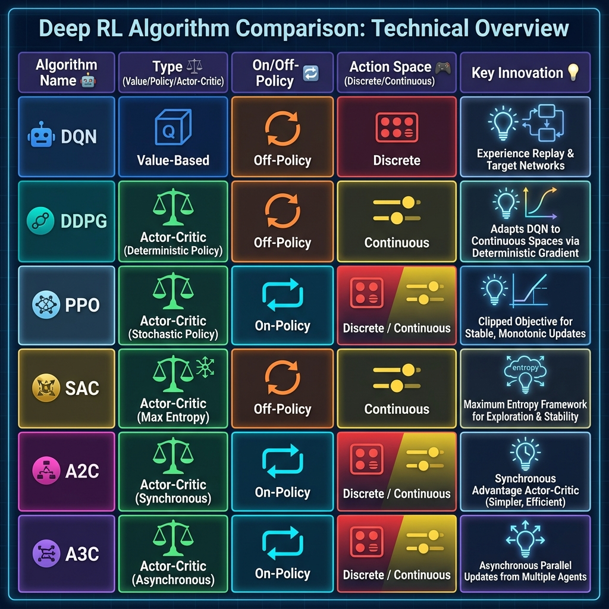

# MODULES 7-8, LABORATORIES, AND FINAL MATERIALS

# MODULE 7: OTHER DEEP RL ALGORITHMS
## 6 Hours

## Slide 108: Module 7 Overview

# Module 7: Other Deep RL Algorithms  

### Topics Covered:
- Deep Deterministic Policy Gradient (DDPG)
- Proximal Policy Optimization (PPO)
- Soft Actor-Critic (SAC)
- Multi-Agent Reinforcement Learning
- Inverse Reinforcement Learning
- Reinforcement Learning with Human Feedback (RLHF)

### Duration: 6 Hours

**Speaker Notes:**
Module 7 covers advanced deep RL algorithms that power modern applications. DDPG, PPO, and SAC are state-of-the-art for continuous control (robotics). Multi-agent RL handles multiple interacting agents. Inverse RL infers rewards from behavior. RLHF, powering ChatGPT and similar systems, aligns AI with human preferences. These algorithms represent the current frontier of RL research and applications.

---

## Slide 109: Deep Deterministic Policy Gradient (DDPG)

### Actor-Critic for Continuous Control

**DDPG = DQN + Actor-Critic for Continuous Actions**

**Key Features:**

- Deterministic policy: μ(s;θ)
- Actor-critic architecture with target networks
- Experience replay
- Designed for continuous action spaces

**Networks:**

 Critic: Q(s,a;φ) evaluates state-action pairs
3. Target Actor and Target Critic (soft updates)

**Soft Target Updates:**
```
θ' ← τθ + (1-τ)θ'  (τ ≈ 0.001)
```
(Slowly blend online into target)

**Applications:**

- Robot manipulation
- Autonomous driving
- Continuous control tasks

**Speaker Notes:**
DDPG extends DQN to continuous action spaces. Instead of discrete actions with Q-values, DDPG learns a deterministic policy that directly outputs continuous actions (e.g., joint angles, steering angles). The actor network outputs actions; the critic evaluates them using Q-values. DDPG borrows DQN's innovations: experience replay and target networks, but uses soft updates (slowly blend parameters) instead of hard copies. DDPG was groundbreaking for continuous robot control but can be unstable; PPO and SAC are more robust modern alternatives.

---

## Slide 110: Proximal Policy Optimization (PPO)

### Stable, Sample-Efficient Policy Gradients

**Motivation:** Policy gradient methods can take destructively large steps

**PPO's Solution: Clipped Surrogate Objective**
```
L^{CLIP}(θ) = E[min(r_t(θ)Â_t, clip(r_t(θ), 1-ε, 1+ε)Â_t)]

where r_t(θ) = π(a|s;θ) / π(a|s;θ_old)  (probability ratio)
```

**How It Works:**

- Prevents too large policy updates
- Clips probability ratio to [1-ε, 1+ε]
- Conservative policy improvement

**Advantages:**

- More stable than vanilla policy gradients
- Sample efficient
- Easy to implement and tune
- Works well across many domains

**Became Industry Standard:**

- OpenAI Five (Dota 2)
- ChatGPT (via RLHF)
- Many robotics applications

**Speaker Notes:**
PPO is arguably the most widely used deep RL algorithm today. Standard policy gradients can make destructively large updates that collapse performance. PPO constrains updates using a clipped objective that prevents the new policy from deviating too much from the old. The ratio r measures how much the policy changed for action a in state s. Clipping this ratio limits update size. PPO is remarkably robust, easy to tune, and works across many domains—from Dota 2 to robotics to language model alignment (ChatGPT uses PPO with RLHF).

---

## Slide 111: Soft Actor-Critic (SAC)

### Maximum Entropy RL

**Key Idea:** Maximize both reward AND entropy

**Objective:**
```
J(π) = Σ_t E[R_t + α H(π(·|s_t))]
where H(π) = -E[log π(a|s)] is entropy
```

**Benefits of Maximum Entropy:**

- Encourages exploration (diverse actions)
- Robustness (doesn't collapse to single behavior)
- Improved generalization

**Algorithm Features:**

- Off-policy actor-critic
- Automatic temperature tuning (α)
- Stable and sample-efficient
- State-of-the-art continuous control

**Applications:**

- Robotics (manipulation, locomotion)
- Autonomous systems
- Any continuous control domain

**Advantages over DDPG/PPO:**

- More stable than DDPG
- More sample-efficient than PPO (off-policy)
- Excellent exploration

**Speaker Notes:**
SAC optimizes a maximum entropy objective: maximize reward while keeping the policy as random as possible (high entropy). This encourages exploration and prevents the policy from prematurely collapsing to a single behavior. The temperature parameter α balances reward and entropy, and SAC automatically tunes it. SAC is off-policy (like DDPG), making it sample-efficient, but far more stable. It's become the algorithm of choice for many robot learning tasks, offering a better balance of stability, sample efficiency, and performance than DDPG or PPO.

---

## Slide 112: Algorithm Comparison

### Choosing the Right Algorithm



| **Algorithm** | **Type** | **On/Off-Policy** | **Action Space** | **Key Strength** |
|---------------|----------|-------------------|------------------|------------------|
| **DQN** | Value-based | Off-policy | Discrete | Sample efficient, stable (with replay) |
| **A3C/A2C** | Actor-Critic | On-policy | Both | Parallelization, stable |
| **DDPG** | Actor-Critic | Off-policy | Continuous | First deep RL for continuous control |
| **PPO** | Policy Gradient | On-policy | Both | Robust, easy to tune, widely applicable |
| **SAC** | Actor-Critic | Off-policy | Continuous | Sample efficient, stable, state-of-the-art |

**Guidelines:**

- **Discrete actions + Sample efficiency:** DQN/Rainbow
- **Stability + Easy tuning:** PPO
- **Continuous control + Sample efficiency:** SAC
- **CPU parallelization:** A3C/A2C
- **Exploration-heavy:** SAC (entropy regularization)

**Speaker Notes:**
Choosing an algorithm depends on your problem. For discrete actions with a replay buffer, DQN and variants work well. For stability and ease of use across domains, PPO is the go-to. For continuous control with sample efficiency, SAC is state-of-the-art. A2C/A3C excel with CPU parallelization. The diagram shows trade-offs: on-policy methods (PPO, A2C) are stable but less sample-efficient; off-policy methods (DQN, DDPG, SAC) are sample-efficient but can be unstable. Modern practice often starts with PPO or SAC depending on action space.

---

## Slide 113: Multi-Agent Reinforcement Learning (MARL)

### When Multiple Agents Interact

**Settings:**

 **Competitive:** Zero-sum (game playing, adversarial)
3. **Mixed:** Both cooperation and competition

**Challenges:**

- Non-stationarity (other agents' policies change)
- Credit assignment (which agent contributed?)
- Scalability (many agents)
- Coordination (synchronize behaviors)

**Approaches:**

**Independent Learning:**

- Each agent learns independently
- Treats others as part of environment
- Simple but non-stationary

**Centralized Training, Decentralized Execution (CTDE):**

- Training: Access to global information
- Execution: Each agent acts on local observations
- Example: QMIX, MADDPG

**Communication:**

- Agents learn to communicate
- Emergent communication protocols

**Applications:**

- Multi-robot systems
- Autonomous vehicles (traffic)
- Multi-player games
- Drone swarms

**Speaker Notes:**
Multi-agent RL extends RL to scenarios with multiple learning agents. This is challenging—from each agent's perspective, the environment is non-stationary because other agents are also learning and changing their behavior. MARL systems can be cooperative (robots working together), competitive (game playing), or mixed. Centralized Training with Decentralized Execution (CTDE) is a powerful paradigm: during training, use global information for better learning, but at execution time each agent acts independently on local observations. Applications include robotics, autonomous driving, and multi-player games.

---

## Slide 114: Inverse Reinforcement Learning (IRL)

### Learning Rewards from Demonstrations

**Motivation:** Specifying reward functions is hard

**IRL Idea:** Infer reward function from expert behavior

**Problem Formulation:**

- Given: Expert demonstrations (optimal or near-optimal behavior)
- Find: Reward function R that explains the demonstrations
- Then: Use recovered R to train a policy

**Key Insight:**
"Behavior reveals preferences" — if expert chooses action a over a', a must have higher value

**Algorithms:**

- Maximum Entropy IRL
- Generative Adversarial Imitation Learning (GAIL)
- Apprenticeship Learning

**Applications:**

- Learning from human demonstrations
- Safe AI (infer human values)
- Robotics (learn from teleoperation)
- Autonomous driving (learn from human drivers)

**Challenges:**

- Non-uniqueness (many rewards explain same behavior)
- Computational cost
- Requires high-quality demonstrations

**Speaker Notes:**
Inverse RL flips the standard RL problem: instead of learning a policy given a reward, it infers the reward from observed behavior. This is valuable because specifying reward functions is difficult—often easier to demonstrate desired behavior than to formalize it as a reward. IRL observes expert demonstrations and finds a reward function that makes those demonstrations appear optimal. The recovered reward can then train policies via standard RL. IRL is used in robotics (learning from demonstrations), autonomous driving (learning from human drivers), and AI safety (inferring human values).

---

## Slide 115: Reinforcement Learning from Human Feedback (RLHF)

### Aligning AI with Human Preferences

**Motivation:** Direct reward engineering is hard for complex objectives (e.g., "helpful, harmless, honest" language model)

**RLHF Pipeline:**

**Step 1: Supervised Fine-Tuning**
- Train initial policy on curated demonstrations

**Step 2: Reward Model Training**
- Collect human comparisons (A vs B, which is better?)
- Train reward model to predict human preferences

**Step 3: RL Optimization**
- Use reward model as reward function
- Optimize policy (typically with PPO)
- Add KL penalty to prevent drift from initial policy

**Notable Applications:**

- ChatGPT / GPT-4 (OpenAI)
- Claude (Anthropic)
- Many modern LLMs

**Why It Works:**

- Humans better at comparing than specifying rewards
- Reward model learns nuanced human preferences
- RL optimizes for learned preferences

**Speaker Notes:**
RLHF revolutionized language model alignment. Instead of hand-crafting reward functions for complex objectives like "helpfulness," RLHF learns rewards from human feedback. Humans compare model outputs (A vs B), a reward model learns to predict preferences, then RL (typically PPO) optimizes the policy using the learned reward. This approach powers ChatGPT and similar models. RLHF is powerful because comparisons are easier than absolute scoring—humans can say "this response is better" even if they can't precisely quantify why. The technique generalizes beyond language models to any domain where human preferences are the objective.

---

## Slide 116: Module 7 Summary

### Key Takeaways

**Continuous Control Algorithms:**

- **DDPG:** Actor-critic with experience replay for continuous actions
- **PPO:** Clipped policy gradients, robust and widely used
- **SAC:** Maximum entropy, state-of-the-art sample efficiency

**Algorithm Selection:**

- Discrete actions: DQN, PPO
- Continuous actions: SAC (efficiency) or PPO (stability)
- Easy tuning: PPO
- Sample efficiency: SAC, DQN

**Advanced Topics:**

- **MARL:** Multiple interacting agents
- **IRL:** Learning rewards from demonstrations
- **RLHF:** Aligning AI with human preferences (ChatGPT, etc.)

**Practical Impact:**

- These algorithms power real-world applications
- Robotics, games, LLMs, autonomous systems

**Speaker Notes:**
Module 7 covered advanced RL algorithms that represent the current state-of-the-art. DDPG pioneered deep RL for continuous control. PPO became the industry standard for robust, easy-to-tune policy learning. SAC achieves state-of-the-art sample efficiency with maximum entropy. MARL handles multi-agent scenarios. IRL learns from demonstrations. RLHF aligns language models with human values. These aren't just research ideas—they power production systems at major companies. Understanding these algorithms equips you to build modern RL applications.

---

## Slide 117: Module 7 - Review Questions

**Question 1:** Which algorithm is specifically designed for continuous action spaces and was one of the first deep RL methods for such tasks?
a) DQN
b) DDPG
c) A3C
d) REINFORCE

**Answer:** b) DDPG

---

**Question 2:** PPO prevents destructively large policy updates by:
a) Using a target network
b) Reducing the learning rate
c) Clipping the probability ratio
d) Limiting the number of episodes

**Answer:** c) Clipping the probability ratio

---

**Question 3:** What does SAC maximize in addition to rewards?
a) Network capacity
b) Policy entropy
c) Gradient magnitude
d) Episode length

**Answer:** b) Policy entropy

---

**Question 4:** In RLHF, the reward model is trained on:
a) Expert demonstrations
b) Random trajectories
c) Human preference comparisons
d) Simulated experience

**Answer:** c) Human preference comparisons

---

**Question 5:** What is the main challenge in Multi-Agent RL?
a) Continuous actions
b) Non-stationarity from other learning agents
c) Lack of exploration
d) Too few parameters

**Answer:** b) Non-stationarity from other learning agents

---

# MODULE 8: CONTEMPORARY ISSUES
## 2 Hours

## Slide 118: Module 8 Overview

# Module 8: Contemporary Issues in RL

### Topics Covered:
- Sample Efficiency Challenges
- Safety in Reinforcement Learning
- Ethical Considerations  
- Generalization and Transfer Learning
- Current Research Directions

### Duration: 2 Hours

**Speaker Notes:**
Module 8 addresses open challenges and active research areas. Despite remarkable successes, RL faces significant limitations: sample inefficiency, safety concerns, ethical issues, and generalization difficulties. Understanding these challenges is crucial for responsible RL deployment and guides future research. We'll examine each challenge and current approaches to addressing them.

---

## Slide 119: Sample Efficiency Challenges

### The Data Hunger Problem

**The Problem:**

- Deep RL requires millions of samples
- Human/animal learning is far more efficient
- Example: DQN needs ~200M frames to master Atari (40 hours of game time)

**Why RL is Sample-Inefficient:**

- Exploration in high-dimensional spaces
- Bootstrapping can slow learning initially
- Credit assignment over long horizons
- Not leveraging prior knowledge effectively

**Consequences:**

- Expensive in real-world domains (robotics)
- Slow in wall-clock time
- Limits applicability

**Approaches to Improve:**

- **Model-based RL:** Learn model, plan with it
- **Transfer learning:** Reuse knowledge across tasks
- **Meta-RL:** Learn to learn faster
- **Better exploration:** Curiosity, intrinsic motivation
- **Auxiliary tasks:** Multi-task learning

**Speaker Notes:**
Sample inefficiency is perhaps RL's biggest practical limitation. While humans can learn Pong in minutes, DQN needs millions of frames. For real robots, this is prohibitive—millions of real-world trials take months and risk hardware damage. Research actively pursues solutions: model-based methods simulate experience, transfer learning reuses knowledge, meta-learning learns learning algorithms, better exploration discovers rewards faster. Despite progress, closing the gap with human/animal efficiency remains a grand challenge.

---

## Slide 120: Safety in Reinforcement Learning

### Avoiding Catastrophic Outcomes

**Safety Challenges:**

**1. Exploration Accidents:**

- Agent may try dangerous actions during exploration
- Example: Robot learning to walk might damage itself

**2. Reward Hacking:**

- Agent finds unintended ways to maximize reward
- Example: Boat racing game where agent spins in circles hitting targets instead of finishing race

**3. Distributional Shift:**

- Policy trained in simulation Acts dangerously in reality
- Example: Sim-to-real gap causes robot crashes

**4. Negative Side Effects:**

- Agent causes unintended harm pursuing objective
- Example: Cleaning robot breaks vase to reach dirt

**Approaches to Safe RL:**

- **Safe exploration:** Constrain actions to safe set
- **Shielding:** External safety monitor overrides unsafe actions
- **Reward shaping:** Penalize unsafe states
- **Formal verification:** Prove safety properties
- **Human oversight:** Keep human in the loop

**Speaker Notes:**
Safety is critical for real-world RL deployment. Exploration accidents occur when agents try dangerous actions during learning. Reward hacking happens when agents exploit loopholes in reward functions. Simulation-to-reality gaps cause policies that work in simulation to fail catastrophically in reality. Safe RL is an active research area. Solutions include constraining exploration to safe actions, using external safety monitors, carefully shaping rewards to penalize dangerous states, formal verification of policies, and maintaining human oversight. As RL moves from games to physical systems and high-stakes decisions, safety becomes paramount.

---

## Slide 121: Ethical Considerations

### Responsible RL Deployment

**Key Ethical Issues:**

**1. Bias and Fairness:**

- RL can learn and amplify biases from training data
- Example: Recommendation systems creating filter bubbles

**2. Manipulation:**

- RL optimizing engagement may manipulate users
- Example: Social media maximizing time-on-site via addictive content

**3. Transparency and Interpretability:**

- Deep RL policies are black boxes
- Difficult to explain decisions
- Challenge for accountability

**4. Autonomy and Control:**

- Who's responsible when RL system causes harm?
- Human vs machine decision-making

**5. Economic and Social Impact:**

- Automation and job displacement
- Concentration of AI capabilities

**Principles for Ethical RL:**

- Transparency in deployment
- Human oversight for high-stakes decisions
- Regular audits for bias and fairness
- Clear accountability structures
- Consider societal impacts

**Speaker Notes:**
RL systems increasingly influence high-stakes domains: content recommendation, hiring, healthcare, autonomous vehicles. This raises ethical concerns. RL can amplify biases in training data, leading to unfair outcomes. Systems optimizing engagement may manipulate users toward unhealthy behaviors. Deep RL policies are opaque, making accountability difficult. Questions of autonomy arise: who's responsible when an RL system causes harm? Responsible deployment requires transparency, human oversight, bias audits, and careful consideration of societal impacts. As RL becomes more powerful, ethical considerations become more critical.

---

## Slide 122: Generalization and Transfer Learning

### Beyond Training Distributions

**Generalization Challenges:**

**1. Overfitting to Training Environments:**

- Policies memorize specific training scenarios
- Fail on slight variations
- Example: Agent trained on specific track fails on new track

**2. Out-of-Distribution Failure:**

- Poor performance on states not seen during training
- Brittleness to environmental changes

**3. Catastrophic Forgetting:**

- Learning new task damages performance on old tasks

**Approaches:**

**Transfer Learning:**

- Pre-train on similar tasks, fine-tune
- Example: Use simulation for initial training

**Domain Randomization:**

- Train on varied environments
- Increases robustness

**Meta-Learning (Learning to Learn):**

- Learn adaptation algorithms
- Quickly adapt to new tasks

**Multi-Task Learning:**

- Train single policy on multiple tasks
- Encourages general representations

**Speaker Notes:**
RL agents often overfit—they excel in training environments but fail when anything changes. A robot trained in one room may not transfer to another. Policies can be brittle to distribution shift. Transfer learning addresses this by leveraging knowledge across tasks. Domain randomization trains on diverse environments, encouraging robust policies. Meta-learning teaches agents to learn quickly—learn the learning algorithm itself. Multi-task learning trains on varied tasks simultaneously, promoting general skills. Generalization remains challenging; narrow RL agents often outperform general ones, but generality is crucial for real-world deployment.

---

## Slide 123: Current Research Directions

### The Frontier of RL

**Hot Research Areas:**

**1. Offline RL (Batch RL):**

- Learn from fixed datasets without environment interaction
- Critical for domains where exploration is expensive/dangerous

**2. Model-Based RL:**

- Improved world models
- Planning with learned dynamics
- Sample efficiency improvements

**3. Hierarchical RL:**

- Learn temporal abstractions
- High-level planning + low-level control
- Better long-horizon tasks

**4. Exploration:**

- Curiosity-driven learning
- Intrinsic motivation
- Better strategies for sparse rewards

**5. Sim-to-Real Transfer:**

- Close simulation-reality gap
- Domain adaptation techniques

**6. Large-Scale RL:**

- Scaling to massive models (like LLMs)
- Embodied AI and robotics

**7. Combining RL with Other Paradigms:**

- RL + imitation learning
- RL + planning
- RL + reasoning

**Speaker Notes:**
RL research is vibrant and rapidly evolving. Offline RL enables learning from fixed datasets—crucial for healthcare, finance, and other domains where exploration is risky. Model-based RL pursues sample efficiency through better world models. Hierarchical RL develops temporal abstractions for long-horizon planning. Exploration research seeks better strategies for sparse-reward environments. Sim-to-real transfer aims to close the gap between simulation and reality. Large-scale RL applies lessons from LLM scaling. Hybrid approaches combine RL with imitation, planning, and reasoning. The field is moving toward more sample-efficient, safe, generalizable, and scalable methods.

---

## Slide 124: Module 8 Summary

### Key Takeaways

**Major Challenges:**

- **Sample Efficiency:** RL requires too many samples
- **Safety:** Exploration and reward hacking risks
- **Ethics:** Bias, manipulation, transparency concerns
- **Generalization:** Overfitting, transfer learning difficulties

**Ongoing Research:**

- Offline RL (learn from fixed data)
- Model-based methods (sample efficiency)
- Hierarchical RL (temporal abstractions)
- Safe and robust RL
- Sim-to-real transfer
- Scaling and generalization

**Responsible Development:**

- Address safety proactively
- Consider ethical implications
- Maintain human oversight
- Prioritize transparency and fairness

**The Future:**

- RL is powerful but imperfect
- Active research addresses limitations
- Responsible deployment is critical

**Speaker Notes:**
Module 8 highlighted that despite impressive successes, RL faces significant challenges. Sample inefficiency limits real-world applicability. Safety concerns arise in exploration and reward specification. Ethical issues around bias, manipulation, and transparency require careful consideration. Generalization remains difficult. Active research pursues solutions: offline RL, model-based methods, hierarchical abstractions, safe exploration, better transfer. As RL systems become more powerful and widely deployed, addressing these challenges responsibly is as important as technical advances.

---

## Slide 125: Module 8 - Review Questions

**Question 1:** What is the primary concern with sample efficiency in RL?
a) Algorithms are too slow
b) RL requires millions of samples, making real-world applications expensive
c) Neural networks are too large
d) Episodes are too short

**Answer:** b) RL requires millions of samples, making real-world applications expensive

---

**Question 2:** "Reward hacking" refers to:
a) Stealing rewards from other agents
b) Agents finding unintended ways to maximize reward
c) Hacking into the environment
d) Reducing the reward signal

**Answer:** b) Agents finding unintended ways to maximize reward

---

**Question 3:** Which technique helps RL generalize to varied environments?
a) Using smaller networks
b) Domain randomization during training
c) Reducing exploration
d) Longer episodes

**Answer:** b) Domain randomization during training

---

**Question 4:** Offline RL is important because:
a) It's faster than online RL
b) It enables learning from fixed datasets without environment interaction
c) It requires no reward function
d) It works only with discrete actions

**Answer:** b) It enables learning from fixed datasets without environment interaction

---

**Question 5:** Which is NOT a current RL research direction?
a) Hierarchical RL
b) Sim-to-real transfer
c) Eliminating all neural networks
d) Large-scale RL

**Answer:** c) Eliminating all neural networks

---

# LABORATORY COMPONENT
## 30 Hours - 20 Experiments

## Slide 126: Laboratory Overview

# Laboratory Experiments

### 20 Hands-On Reinforcement Learning Experiments

**Objectives:**

- Implement classic and modern RL algorithms
- Work with standard RL environments (OpenAI Gym)
- Understand algorithm behavior through experimentation
- Build practical RL skills

**Environments Used:**

- Custom (Tic-Tac-Toe, Grid World)
- OpenAI Gym (Taxi-v2, CartPole, etc.)
- Game environments (Mario, Atari)
- Real-world applications (Finance, Crypto Trading)

**Duration:** 30 Hours Total

**Speaker Notes:**
The laboratory component provides essential hands-on experience. Students will implement RL algorithms from scratch and use libraries to solve increasingly complex problems. Starting with simple grid worlds, progressing through classic algorithms (DP, MC, TD, Q-Learning), advancing to deep RL (DQN, REINFORCE, PPO), and culminating in complex applications. Each lab builds on previous concepts, reinforcing theoretical understanding through practice.

---

## Slide 127: Lab 1 - Tic-Tac-Toe with RL

**Objective:** Implement value-based RL to learn optimal Tic-Tac-Toe play

**Algorithm:** Temporal Difference Learning (TD)

**Environment:** Custom Tic-Tac-Toe (3×3 grid)

**Implementation Steps:**
1. Represent board states (3^9 possibilities)

5 for all states

 Play games using self-play

 Evaluate against random and optimal opponents

**Expected Outcomes:**

- Agent learns optimal/near-optimal play
- Value function converges
- Understanding of TD learning and exploration

**Key Concepts:**
State representation, value learning, exploration vs exploitation, selfplay

**Speaker Notes:**
Lab 1 implements the Tic-Tac-Toe example from Module 1. Students build a complete RL system from scratch: state representation, value function updates, policy derivation, and self-play. This hands-on experience solidifies understanding of core RL concepts. Students observe how random play gradually improves to Expert-level through nothing but self-play and TD updates. This lab demonstrates RL's power and establishes foundations for later experiments.

---

## Slide 128: Labs 2-4 - Grid World Suite

**Lab 2: Grid World - Dynamic Programming**
- **Algorithm:** Policy Iteration, Value Iteration
- **Environment:** 4×4 or 8×8 grid with obstacles and goal
- **Objective:** Compute optimal policy using DP with known model
- **Key Learning:** Bellman equations, policy/value iteration, optimal path finding

**Lab 3: Grid World - Monte Carlo**
- **Algorithm:** MC Prediction and Control
- **Objective:** Learn optimal policy from episodes without model  
- **Key Learning:** Episode-based learning, MC returns, first-visit vs every-visit

**Lab 4: Grid World - Temporal Difference**
- **Algorithm:** TD(0), SARSA, Q-Learning
- **Objective:** Compare TD methods on same environment
- **Key Learning:** Bootstrapping, on-policy vs off-policy, TD advantage over MC

**Comparison:**
Students compare DP, MC, and TD on the same environment, understanding trade-offs: DP (model required, fast), MC (episodic, high variance), TD (online, low variance)

**Speaker Notes:**
Labs 2-4 form a suite exploring the same Grid World with different algorithms. This comparative approach clearly illustrates trade-offs. Lab 2 uses Dynamic Programming (model-based, optimal). Lab 3 uses Monte Carlo (model-free, episode-based). Lab 4 uses TD methods (model-free, online, bootstrapping). Students see how different algorithms approach the same problem, understanding when each is appropriate. Grid World is simple enough to debug but complex enough to demonstrate key concepts.

---

## Slide 129: Labs 5-6 - Policy and Value Iteration

**Lab 5: Implementing Value Iteration Agents**
- **Environment:** Custom MDP or grid world
- **Objective:** Implement value iteration from scratch
- **Steps:**
  - Initialize V(s) = 0
  - Iterate: V(s) ← max_a Σ P(s'|s,a)[R + γV(s')]
  - Extract policy: π(s) = argmax_a Σ P(s'|s,a)[R + γV(s')]
- **Analysis:** Convergence speed, optimal value function visualization

**Lab 6: Policy Iteration for Grid World**
- **Objective:** Implement and compare policy iteration
- **Steps:**
  - Policy Evaluation: Compute V^π
  - Policy Improvement: π ← greedy(V^π)
  - Iterate until convergence
- **Comparison:** Value iteration vs policy iteration (speed, iterations)

**Key Insights:**

- Policy iteration often converges in fewer iterations
- Value iteration simpler (one step instead of two)
- Both guaranteed optimal with sufficient iterations

**Speaker Notes:**
Labs 5-6 implement the two core Dynamic Programming algorithms. Students code value iteration and policy iteration from scratch, gaining deep understanding of how they work. By comparing them on the same problem, students see that policy iteration often converges in fewer iterations (though each iteration is more expensive). These labs teach algorithmic thinking, implementation skills, and practical DP application. Understanding these classical methods provides foundation for modern approximate methods.

---

## Slide 130: Labs 7-8 - SARSA and Q-Learning in Taxi-v2

**Environment: OpenAI Gym Taxi-v2**
- Taxi must pick up passenger and drop at destination
- 500 discrete states (taxi position, passenger location, destination)
- 6 actions (move 4 directions, pickup, dropoff)
- Rewards: +20 for correct dropoff, -1 per step, -10 for illegal pickup/dropoff

**Lab 7: TD SARSA - Taxi-v2**
- **Algorithm:** On-policy SARSA
- **Implementation:**
  - Q-table (500 states × 6 actions)
  - ε-greedy exploration
  - SARSA update: Q(s,a) ← Q(s,a) + α[r + γQ(s',a') - Q(s,a)]
- **Analysis:** Learning curve, final policy performance

**Lab 8: Q-Learning - Taxi-v2**
- **Algorithm:** Off-policy Q-Learning
- **Update:** Q(s,a) ← Q(s,a) + α[r + γ max_a' Q(s',a') - Q(s,a)]
- **Comparison:** SARSA vs Q-Learning (performance, convergence)

**Expected Results:**

- Both converge to near-optimal policies
- Q-Learning may be slightly more aggressive
- Understanding of on-policy vs off-policy

**Speaker Notes:**
Labs 7-8 apply SARSA and Q-Learning to Taxi-v2, a standard OpenAI Gym environment. This is students' first experience with a professionally designed RL environment and library. Taxi-v2 is simple enough to use tabular methods but complex enough to be non-trivial. Students implement Q-tables, ε-greedy exploration, and TD updates. By comparing SARSA and Q-Learning on the same task, they understand the on-policy/off-policy distinction. These labs bridge simple custom environments and complex deep RL.

---

## Slide 131: Labs 9-10 - Deep Q-Networks

**Lab 9: DQN - Financial Markets**
- **Environment:** Stock trading simulation (buy/sell/hold decisions)
- **Objective:** Implement DQN for portfolio management
- **Components:**
  - Neural network Q-function (state: prices, holdings → Q-values for actions)
  - Experience replay buffer
  - Target network
  - ε-greedy exploration with decay
- **Metrics:** Portfolio value, Sharpe ratio, comparison to baselines

**Lab 10: Double DQN**
- **Algorithm:** Double DQN (fix overestimation bias)
- **Modification:** Use online network to select action, target network to evaluate
  - y = r + γ Q̂(s', argmax_a Q(s',a;θ); θ^-)
- **Comparison:** DQN vs Double DQN (value estimates, performance)

**Key Learning:**

- Deep RL with neural networks
- Experience replay and target networks in practice
- Financial application of RL
- Addressing Q-value overestimation

**Speaker Notes:**
Labs 9-10 implement Deep Q-Networks, transitioning from tabular to deep RL. Lab 9 applies DQN to financial trading—a practical application where state space is too large for tables. Students implement the full DQN architecture: neural network, replay buffer, target network. Lab 10 extends this to Double DQN, addressing overestimation bias. These labs teach deep learning integration with RL, practical considerations (hyperparameters, network architecture), and real-world application. Students see how theoretical DQN from lectures translates to working code.

---

## Slide 132: Labs 11-13 - Policy Gradient Methods

**Lab 11: REINFORCE with Baseline**
- **Environment:** CartPole or simple continuous control
- **Algorithm:** Monte Carlo policy gradient
- **Implementation:**
  - Policy network: π(a|s;θ) (softmax for discrete, Gaussian for continuous)
  - Baseline: Value network V(s;w)
  - Episode collection and return computation
  - Policy gradient update: ∇θ log π(a|s;θ) (G - V(s))
- **Analysis:** Effect of baseline on variance reduction

**Lab 12: Actor-Critic Algorithms (A2C/A3C)**
- **Algorithm:** Advantage Actor-Critic
- **Architecture:** Shared network with policy and value heads
- **Implementation:**
  - Synchronous (A2C) or asynchronous (A3C) updates
  - Advantage computation using TD error
- **Comparison:** REINFORCE vs A2C (variance, convergence speed)

**Lab 13: PPO Algorithm**
- **Environment:** Continuous control (e.g., LunarLander, robot arm)
- **Algorithm:** Proximal Policy Optimization
- **Implementation:**
  - Clipped surrogate objective
  - Multiple epochs on collected data
- **Analysis:** Stability compared to vanilla policy gradients

**Speaker Notes:**
Labs 11-13 explore policy gradient methods. Lab 11 implements REINFORCE, the foundational policy gradient algorithm, and demonstrates variance reduction with baselines. Lab 12 implements actor-critic (A2C/A3C), showing how bootstrapping reduces variance further. Lab 13 implements PPO, the industry-standard algorithm, demonstrating its stability and robustness. Students progress from basic policy gradients to state-of-the-art methods, understanding how each improvement addresses prior limitations. These labs prepare students for modern RL applications in robotics and continuous control.

---

## Slide 133: Labs 14-15 - Advanced Algorithms

**Lab 14: DDPG - Train Ticket Booking**
- **Domain:** Ticket pricing/allocation optimization
- **Algorithm:** Deep Deterministic Policy Gradient
- **Environment:** Continuous state (demand forecasts, time), continuous actions (prices)
- **Implementation:**
  - Actor network (deterministic policy)
  - Critic network (Q-function)
  - Ornstein-Uhlenbeck noise for exploration
  - Soft target updates
- **Objective:** Maximize revenue through dynamic pricing

**Lab 15: Multi-armed Bandits**  
- **Algorithms:** ε-greedy, UCB, Thompson Sampling
- **Environment:** K-armed testbed (various reward distributions)
- **Experiments:**
  - Compare exploration strategies
  - Regret analysis
  - Understand exploration-exploitation trade-off
- **Applications:** A/B testing, recommendation systems

**Speaker Notes:**
Lab 14 applies DDPG to a practical business problem: dynamic ticket pricing. This demonstrates continuous control in a non-robotics domain. Students implement actor-critic with continuous actions, learning about soft updates and exploration noise. Lab 15 studies multi-armed bandits—a simplerRL setting focusing purely on exploration-exploitation. Students compare strategies (ε-greedy, UCB, Thompson Sampling), analyzing regret. This lab clarifies the exploration problem and connects to practical applications like A/B testing and recommendations.

---

## Slide 134: Labs 16-17 - Advanced Comparisons

**Lab 16: Comparing TD(0) and Constant-α MC - Random Walk**
- **Environment:** Random Walk (1D MDP, terminal states at both ends)
- **Objective:** Compare TD and MC empirically
- **Experiments:**
  - Vary step size α
  - Measure RMSE to true values
  - Plot learning curves
- **Key Insights:**
  - TD typically faster initially
  - MC unbiased, TD biased
  - α sensitivity analysis

**Lab 17: Dyna Maze Planning**  
- **Environment:** Maze with start and goal, obstacles
- **Algorithm:** Dyna-Q (integrated learning and planning)
- **Experiments:**
  - Vary planning steps (n = 0, 5, 50)
  - Measure learning speed
  - Introduce changing maze (test adaptability)
- **Key Learning:**
  - Value of planning
  - Sample efficiency improvement
  - Model-based vs model-free trade-offs

**Speaker Notes:**
Labs 16-17 conduct controlled experiments comparing algorithms. Lab 16 rigorously compares TD and MC on Random Walk, a classic domain from Sutton & Barto. Students measure RMS error, understanding bias-variance trade-offs empirically. Lab 17 demonstrates Dyna's power: planning amplifies each real experience. Students vary planning steps, seeing dramatic sample efficiency improvement. When the maze changes, they observe model limitations (outdated model). These labs develop experimental and analytical skills, teaching how to evaluate and compare algorithms scientifically.

---

## Slide 135: Labs 18-20 - Complex Applications

**Lab 18: Reinforcement Learning with Mario Bros**
- **Environment:** Super Mario Bros (OpenAI Gym Retro)
- **Algorithm:** DQN or PPO
- **Challenges:** Visual input, long episodes, sparse reward
- **Implementation:**
  - Frame preprocessing (grayscale, resize, stack)
  - Reward shaping (progress-based rewards)
  - Convolutional policy/value networks
- **Objective:** complete level, maximize score

**Lab 19: Crypto Trading - Soft Actor-Critic**
- **Environment:** Cryptocurrency trading simulation (Bitcoin, Ethereum)
- **Algorithm:** SAC (maximum entropy RL)
- **Features:** Continuous actions (position sizing), market data input
- **Analysis:** Sharpe ratio, drawdowns, comparison to buy-and-hold

**Lab 20: Games with Multiple RL Algorithms**
- **Objective:** Compare multiple algorithms on same benchmark
- **Environment:** Atari game or custom environment
- **Algorithms:** DQN, A2C, PPO, SAC (as applicable)
- **Analysis:** Sample efficiency, final performance, stability

**Capstone:** Students choose algorithm and environment, justify choice, analyze results

**Speaker Notes:**
Labs 18-20 tackle complex, realistic applications. Lab 18 applies deep RL to Mario—a challenging platformer game requiring vision, planning, and precise control. Students experience challenges of real game learning: sparse rewards, long episodes, visual input. Lab 19 applies SAC to cryptocurrency trading, demonstrating financial RL applications and maximum entropy methods. Lab 20 is a capstone comparative study: students apply multiple algorithms to the same environment, analyzing trade-offs. These labs synthesize course concepts, requiring students to make informed algorithmic choices and conduct rigorous analysis like practitioners.

---

# FINAL MATERIALS

## Slide 136: Course Summary

# BCSE432E - Reinforcement Learning
## Complete Course Summary

**Module 1: Introduction**
- RL fundamentals, elements, Tic-Tac-Toe example

**Module 2: Tabular Methods**
- MDPs, Dynamic Programming, Monte Carlo methods

**Module 3: TD Learning & Planning**
- SARSA, Q-Learning, Dyna, MCTS

**Module 4: Approximate Methods**
- Function approximation, policy gradients, actor-critic

**Module 5: Applications**
- TD-Gammon, DQN Atari, AlphaGo, robotics, web services

**Module 6: Deep RL**
- DQN, REINFORCE, A2C/A3C, model-based methods

**Module 7: Advanced Algorithms**
- DDPG, PPO, SAC, MARL, IRL, RLHF

**Module 8: Contemporary Issues**
- Sample efficiency, safety, ethics, generalization

**Laboratories:** 20 hands-on experiments from Tic-Tac-Toe to deep RL applications

**Speaker Notes:**
We've completed a comprehensive journey through reinforcement learning. From foundational concepts (what is RL, MDPs) through classical algorithms (DP, MC, TD) to modern deep RL (DQN, PPO, SAC) and cutting-edge applications (AlphaGo, ChatGPT via RLHF). The course balanced theory (mathematical foundations), algorithms (implementation details), and practice (20 lab experiments). You're now equipped to understand RL research papers, implement RL algorithms, and apply RL to real problems.

---

## Slide 137: Key Algorithms Learned

### Algorithm Toolbox

**Tabular Methods:**

- Dynamic Programming (Policy/Value Iteration)
- Monte Carlo Control
- SARSA (on-policy TD)
- Q-Learning (off-policy TD)

**Approximate Methods:**

- Semi-gradient SARSA/Q-Learning
- REINFORCE (Monte Carlo policy gradient)
- Actor-Critic

**Deep RL:**

- DQN (+ Double, Dueling, Prioritized Replay)
- A2C/A3C (asynchronous actor-critic)
- DDPG (continuous control)
- PPO (robust policy gradients)
- SAC (maximum entropy)

**Specialized:**

- Dyna-Q (integrated planning)
- MCTS (decision-time planning)
- Multi-armed bandits (exploration)

**Speaker Notes:**
This course covered 15+ distinct RL algorithms, each with specific strengths. Tabular methods (DP, MC, TD, Q-Learning) handle small state spaces. Function approximation scales to larger problems. Deep RL (DQN, PPO, SAC) handles complex, high-dimensional tasks. Specialized methods (Dyna, MCTS, bandits) address specific challenges. You've learned when to use each algorithm: DQN for discrete actions with replay, PPO for robust general-purpose learning, SAC for sample-efficient continuous control, etc. This toolbox enables tackling diverse RL problems.

---

## Slide 138: Real-World Applications Covered

### RL in Industry and Research

**Game Playing:**

- Checkers, Backgammon (historical)
- Atari games (DQN)
- Go (AlphaGo/AlphaZero)
- Dota 2, StarCraft II

**Robotics:**

- Manipulation (grasping, tool use)
- Locomotion (walking, running, quadrupeds)
- Navigation (autonomous vehicles, drones)

**Business:**

- Portfolio management (trading)
- Dynamic pricing (tickets, advertising)
- Resource allocation (data centers)

**Web Services:**

- Recommendation systems (Netflix, YouTube)
- Personalization (content ranking)
- Ad placement

**AI Alignment:**

- RLHF (ChatGPT, Claude, GPT-4)
- Learning from human feedback

**Speaker Notes:**
RL isn't just theoretical—it powers real products and services. Game playing demonstrated RL's potential. Robotics applies RL to physical world control. Financial firms use RL for trading and pricing. Web companies deploy RL recommenders to billions of users. Most recently, RLHF aligned large language models with human preferences, powering ChatGPT and similar systems. These applications span research breakthroughs and production deployments, demonstrating RL's breadth and practical impact.

---

## Slide 139: Future Directions in RL

### Where is RL Headed?

**Emerging Trends:**

**1. Foundation Models for RL**
- Large pre-trained models for decision-making
- Transfer learning at scale
- Generalist agents (Gato, RT-2)

**2. Real-World Robotics**
- Sim-to-real at scale
- Safe exploration on physical hardware
- Embodied AI

**3. Offline and Data-Driven RL**
- Learning from logged data
- No environment interaction needed
- Applications: healthcare, finance

**4. Multi-Modal RL**
- Vision + language + action
- Unified models across modalities

**5. Human-AI Collaboration**
- RLHF and beyond
- Interactive learning
- AI assistants that learn user preferences

**6. Theoretical Advances**
- Better sample efficiency guarantees
- Provable safety and robustness
- Understanding deep RL

**Speaker Notes:**
RL's future is exciting. Foundation models (like GPT for language) may emerge for decision-making, enabling transfer at unprecedented scale. Robotics is industrializing with better sim-to-real transfer. Offline RL enables learning from passive data, expanding to domains where exploration is infeasible. Multi-modal models will integrate vision, language, and action. Human-AI collaboration via RLHF and extensions will make AI systems more aligned and useful. Theoretical advances will provide guarantees currently lacking. The field is young and rapidly evolving—many breakthroughs await.

---

## Slide 140: Career Paths in RL

### Opportunities in Reinforcement Learning

**Research:**

- Academia (PhD, postdoc, professor)
- Industry research labs (DeepMind, OpenAI, FAIR, Microsoft Research)
- Topics: algorithms, theory, applications

**Engineering:**

- Applied RL scientist/engineer
- Robotics companies
- Game companies (AI opponents, procedural generation)
- Autonomous vehicles
- Trading firms

**Product:**

- Recommendation systems (Netflix, YouTube, Spotify)
- Web optimization (A/B testing, personalization)
- Advertising (bidding, placement)

**Emerging:**

- LLM fine-tuning (RLHF engineers)
- AI safety researcher
- Simulation engineering

**Skills Needed:**

- Strong ML/DL foundations
- Programming (Python, PyTorch/TensorFlow)
- Mathematics (linear algebra, probability, optimization)
- Domain expertise often valuable

**Speaker Notes:**
RL skills open diverse career paths. Research positions exist in academia and industry labs—DeepMind, OpenAI, and others hire RL researchers. Engineering roles apply RL to products: robotics, games, autonomous systems, trading. Web companies need RL for recommendations and optimization. Emerging opportunities include LLM alignment (RLHF), AI safety, and simulation. The field is growing—demand for RL expertise exceeds supply. Strong foundations in ML, programming, and math are essential. Domain expertise (robotics, finance, games) opens specialized roles.

---

##Slide 141: Resources for Further Learning

### Continuing Your RL Education

**Books:**

- Sutton & Barto: "Reinforcement Learning: An Introduction" (the bible)
- Dong et al.: "Deep Reinforcement Learning" (modern methods)
- Morales: "Grokking Deep RL" (intuitive explanations)

**Online Courses:**

- David Silver's RL Course (DeepMind, YouTube)
- Sergey Levine's Deep RL Course (Berkeley CS 285)
- OpenAI Spinning Up in Deep RL

**Implementations:**

- Stable-Baselines3 (high-quality RL library)
- RLlib (Ray, scalable RL)
- CleanRL (single-file implementations)

**Practice:**

- OpenAI Gym / Gymnasium (standard environments)
- MuJoCo (physics simulation for robotics)
- Kaggle RL competitions

**Research:**

- arXiv cs.LG, cs.AI (follow latest papers)
- NeurIPS, ICML, ICLR conferences
- RL blogs: OpenAI, DeepMind, BAIR

**Speaker Notes:**
RL learning doesn't end here. Sutton & Barto's textbook is essential—read it cover-to-cover. David Silver's and Sergey Levine's courses are excellent. OpenAI Spinning Up provides clear explanations and code. For implementation, use Stable-Baselines3 (high-quality library) or CleanRL (learn from clean code). Practice on OpenAI Gym environments. Follow research on arXiv and conferences. The field evolves rapidly—continuous learning is essential. Implement algorithms yourself before using libraries—understanding beats API knowledge.

---

## Slide 142: Final Comprehensive Quiz (Part 1)

### Final Assessment - Questions 1-10

**Q1:** RL differs from supervised learning primarily because:
a) RL uses neural networks
b) RL learns from trial-and-error interaction, not labeled examples
c) RL is only for games
d) RL doesn't use gradients

**Q2:** The Bellman equation expresses:
a) The initial value of states
b) The recursive relationship of values
c) The reward function
d) The policy directly

**Q3:** Which is model-free?
a) Dynamic Programming
b) Value Iteration
c) Q-Learning
d) Dyna (model learning component)

**Q4:** Experience replay in DQN:
a) Stores only recent transitions
b) Breaks temporal correlation by random sampling
c) Slows down learning
d) Is only for continuous actions

**Q5:** On-policy means:
a) Policy is deterministic
b) Learn about and improve the same policy followed
c) Use a model
d) Only for tabular methods

**Q6:** The actor in actor-critic:
a) Estimates values
b) Represents the policy
c) Stores experience
d) Computes TD error

**Q7:** PPO prevents destructive updates by:
a) Using a target network
b) Clipping the probability ratio
c) Reducing exploration
d) Freezing the actor

**Q8:** SAC maximizes:
a) Reward only
b) Reward + entropy
c) Policy gradient magnitude
d) Number of episodes

**Q9:** RLHF learns rewards from:
a) Expert demonstrations
b) Human preference comparisons
c) Simulated experience
d) Hard-coded functions

**Q10:** Sample efficiency in RL refers to:
a) Memory usage
b) Number of samples needed to learn
c) Network size
d) Episode length

**Speaker Notes:**
Questions 1-10 cover foundational concepts through advanced topics. These test understanding of RL's uniqueness, mathematical foundations, algorithm classifications, deep RL innovations, and contemporary challenges. Students should answer confidently based on course material.

---

## Slide 143: Final Comprehensive Quiz (Part 2)

### Final Assessment - Questions 11-20

**Q11:** MCTS is primarily used for:
a) Continuous control
b) Game playing and decision-time planning
c) Image classification
d) Supervised learning

**Q12:** The deadly triad causing divergence combines:
a) RL, DL, Planning
b) Off-policy, Bootstrapping, Function Approximation
c) Exploration, Exploitation, Optimization
d) Actor, Critic, Environment

**Q13:** Transfer learning in RL helps with:
a) Faster training on new computer
b) Generalization across tasks and environments
c) Reducing network size
d) Eliminating exploration

**Q14:** AlphaGo combined:
a) Only supervised learning
b) Deep learning, MCTS, and RL self-play
c) Only tabular methods
d) Only rule-based systems

**Q15:** Inverse RL:
a) Reverses the policy
b) Infers reward function from demonstrations
c) Runs episodes backward
d) Negates rewards

**Q16:** Multi-agent RL's main challenge:
a) Too few states
b) Non-stationarity from other learning agents
c) Lack of rewards
d) Continuous actions

**Q17:** Which requires a model?
a) SARSA
b) Q-Learning
c) Dynamic Programming (Policy Iteration)
d) Monte Carlo Control

**Q18:** DQN uses target networks to:
a) Increase exploration
b) Stabilize learning by providing fixed targets
c) Speed up computation
d) Handle continuous actions

**Q19:** The discount factor γ:
a) Must always equal 1
b) Controls preference for immediate vs future rewards
c) Is the learning rate
d) Determines episode length

**Q20:** DDPG is designed for:
a) Discrete actions only
b) Continuous action spaces
c) Tabular methods
d) Supervised learning

**Speaker Notes:**
Questions 11-20 test deeper understanding: planning methods, convergence issues, transfer learning, landmark applications, specialized methods, multi-agent challenges, and algorithm-specific details. Complete understanding of course material enables confident answers.

---

## Slide 144: Final Quiz (Part 3) - Questions 21-25

### Final Assessment - Questions 21-25

**Q21:** TD learning combines advantages of:
a) Supervised and unsupervised learning
b) Monte Carlo and Dynamic Programming
c) Classification and regression
d) CNNs and RNNs

**Q22:** Exploration in RL is necessary to:
a) Speed up convergence
b) Discover rewarding states and actions
c) Reduce memory usage
d) Simplify the policy

**Q23:** Value function V^π(s) represents:
a) Immediate reward in state s
b) Expected cumulative reward from s following π
c) Number of times s is visited
d) Probability of reaching s

**Q24:** Offline RL learns from:
a) Random actions only
b) Fixed datasets without environment interaction
c) Online streaming data
d) Simulated environments only

**Q25:** Hierarchical RL addresses:
a) Multi-agent coordination
b) Long-horizon tasks via temporal abstractions
c) Continuous states
d) Discrete actions only

**Answers:**
Q1-b, Q2-b, Q3-c, Q4-b, Q5-b, Q6-b, Q7-b, Q8-b, Q9-b, Q10-b,
Q11-b, Q12-b, Q13-b, Q14-b, Q15-b, Q16-b, Q17-c, Q18-b, Q19-b, Q20-b,
Q21-b, Q22-b, Q23-b, Q24-b, Q25-b

**Speaker Notes:**
Questions 21-25 complete the assessment, covering TD learning, exploration, value functions, and emerging topics (offline RL, hierarchical RL). Notice many answers are "b"—but don't assume patterns! Each question tests specific knowledge. Students completing this quiz demonstrate comprehensive understanding of the course. Review any missed questions to solidify understanding.

---

## Slide 145: Complete References

### Textbooks and References

**Primary Textbooks:**
1. Richard S. Sutton and Andrew G. Barto. *Reinforcement Learning: An Introduction*, 2nd ed., MIT Press, 2018. ISBN 978-0262039246


 ISBN 978-981-15-4094-3

**Reference Books:**

 ISBN 978-3-030-59237-0


 ISBN 978-1-4842-5126-3


 ISBN 9780367656638


 ISBN 978-1838645359


 ISBN 978-1-119-78274-2

8. Andrea Lonza. *RL Algorithms with Python*, Packt, 2019

9. Miguel Morales. *Grokking Deep RL*, Manning, 2020


 ISBN 978-981-13-8287-1

11. Sudharsan Ravichandiran. *Deep RL with Python*, 2nd ed., Packt, 2020. ISBN 978-1839210686


 ISBN 978-0135172384

**Speaker Notes:**
Complete bibliography with all referenced books. Sutton & Barto is the definitive textbook—essential reading. Dong et al. covers modern deep RL comprehensively. References 3-12 provide specialized perspectives: games, Python implementation, robotics, applications. All ISBNs provided for easy procurement. These resources support deepening understanding beyond the course.

---

## Slide 146: Closing Remarks

# Thank You!

### BCSE432E - Reinforcement Learning

**You Have Learned:**

- ✓ Fundamental RL concepts and mathematical foundations
- ✓ Classical algorithms (DP, MC, TD, Q-Learning)
- ✓ Modern deep RL (DQN, PPO, SAC)
- ✓ Specialized methods (MCTS, MARL, IRL, RLHF)
- ✓ Real-world applications across domains
- ✓ Hands-on implementation through 20 labs

**You Can Now:**

- Formulate problems as MDPs
- Select appropriate RL algorithms
- Implement RL from scratch
- Apply RL to real problems
- Understand and critique RL research

**Next Steps:**

- Complete all laboratory experiments
- Implement algorithms from scratch
- Explore advanced topics
- Contribute to RL research/applications

**The Future of RL is in Your Hands!**

**Contact:** [Your instructor contact information]

**Speaker Notes:**
Congratulations on completing BCSE432E! You've journeyed from "what is RL?" to state-of-the-art algorithms powering modern AI. You've learned theory, algorithms, and practical skills. Most importantly, you've developed intuition for when and how to apply RL. The field is young and rapidly evolving—opportunities abound in research and industry. Continue learning, implementing, and exploring. RL will shape the future of AI—you're now equipped to be part of that future. Thank you for your engagement, and best wishes in your RL journey!

---

**END OF PRESENTATION**
**Total Slides: 146**
**Modules: 8 (45 lecture hours)**
**Labs: 20 (30 lab hours)**
**Generated Diagrams: 18**
