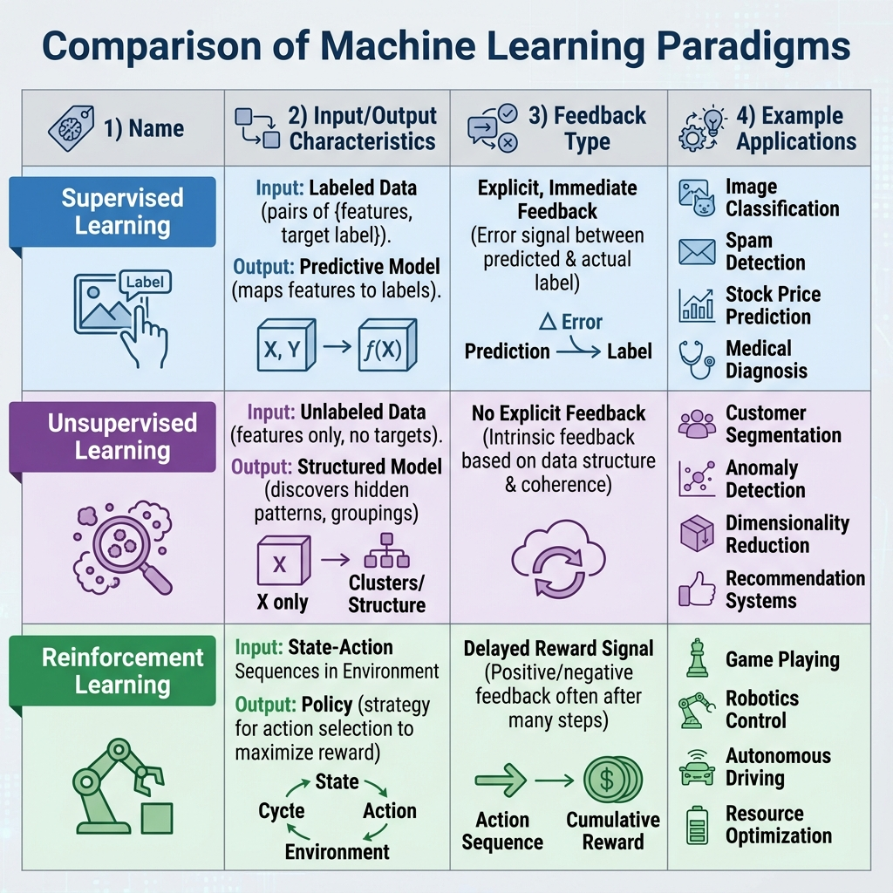
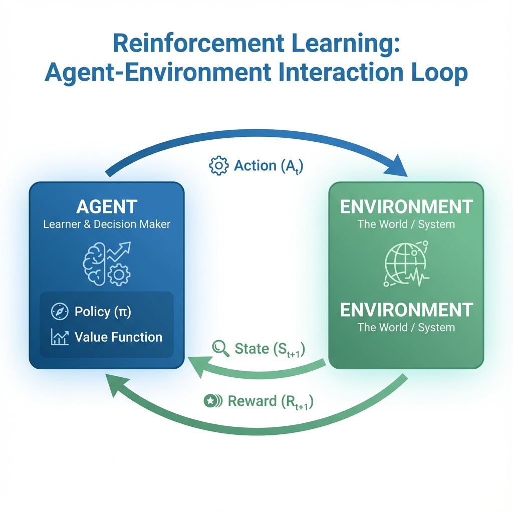
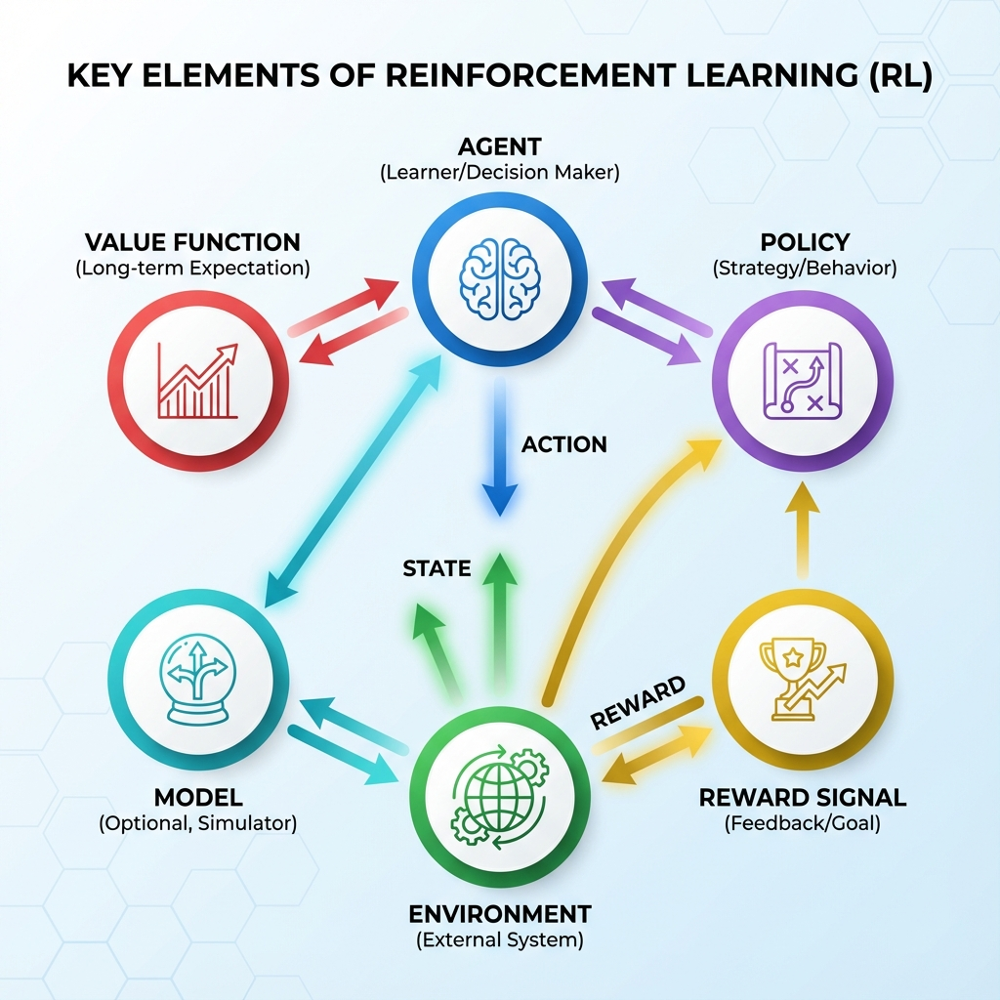
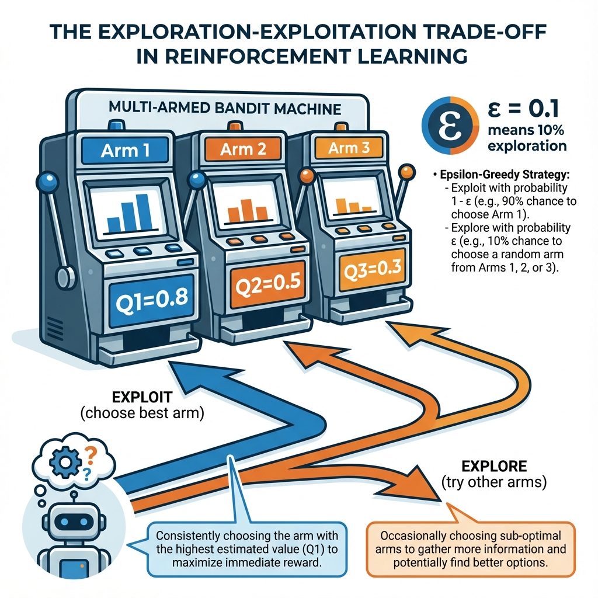
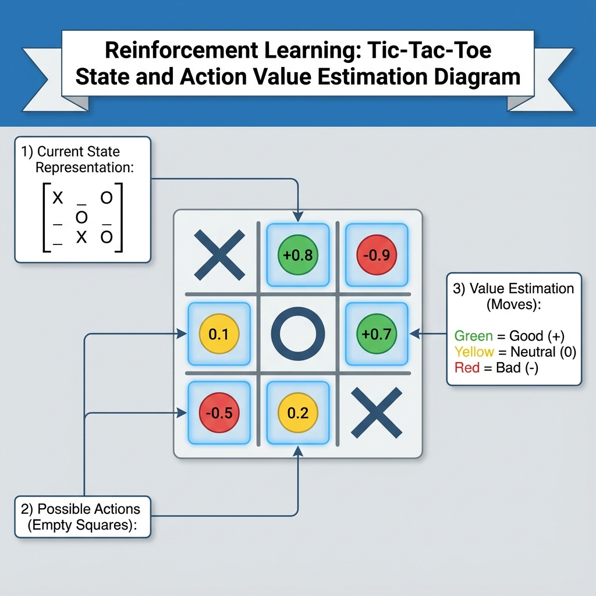

# BCSE432E – Reinforcement Learning
## Complete Course Presentation

---

## Slide 1: Course Title

# BCSE432E
# Reinforcement Learning

**L-T-P-C:** 3-0-2-4

**Syllabus Version:** 1.0

**Pre-requisite:** NIL

**Speaker Notes:**
Welcome to BCSE432E - Reinforcement Learning. This is a 4-credit course with 3 hours of lectures per week and 2 hours of laboratory work. The course has no prerequisites and is designed for undergraduate engineering students who are learning RL for the first time. This course will cover both theoretical foundations and practical implementations of reinforcement learning algorithms.

---

## Slide 2: Course Objectives

### Course Objectives


 **To identify and apply classic Reinforcement Learning methods and Approximate solution methods for problem solving**
   - Tabular methods
   - Function approximation
   - Policy optimization

3. **To understand and apply deep reinforcement learning for complex real-world problems**
   - Deep Q-Networks
   - Policy gradient methods
   - Advanced algorithms

**Speaker Notes:**
The course has three main objectives. First, students will develop a solid understanding of what reinforcement learning is, how it differs from other machine learning paradigms, and where it can be applied. Second, students will learn to implement and apply classic RL algorithms including dynamic programming, Monte Carlo methods, and temporal difference learning, as well as approximate solution methods. Third, students will gain expertise in modern deep reinforcement learning techniques that enable solving complex real-world problems in robotics, game playing, and autonomous systems.

---

## Slide 3: Course Outcomes

### Upon completion of this course, students will be able to:

**CO1:** Articulate the fundamental concepts of reinforcement learning (RL) underlying finite Markov Decision Processes, optimal policies, and value functions.

**CO2:** Demonstrate proficiency in implementing/formulating RL algorithms to solve real-world problems with finite state spaces for prediction, control, and planning.

**CO3:** Critically analyze and compare approximate solution methods, policy gradient methods, actor-critic methods etc., evaluating the efficiency and trade-offs of these methods for complex reinforcement learning challenges.

**CO4:** Evaluate the effectiveness of deep reinforcement learning algorithms in solving problems in diverse domains.

**Speaker Notes:**
The course outcomes are designed to build progressively. CO1 focuses on theoretical understanding of RL fundamentals. CO2 emphasizes practical implementation skills for tabular methods. CO3 develops critical thinking about approximate methods and their trade-offs. Finally, CO4 ensures students can evaluate and apply deep RL to real-world problems across various domains including robotics, game playing, and autonomous systems.

---

## Slide 4: Course Structure Overview

### Course Structure

| Module | Topic | Hours |
|--------|-------|-------|
| 1 | Introduction | 4 |
| 2 | Tabular Solution Methods | 7 |
| 3 | Other Tabular Methods, Planning & Learning | 8 |
| 4 | Approximate Solution Methods | 6 |
| 5 | Applications & Case Studies | 4 |
| 6 | Deep Reinforcement Learning | 8 |
| 7 | Other Deep RL Algorithms | 6 |
| 8 | Contemporary Issues | 2 |

**Total Lecture Hours:** 45  
**Total Laboratory Hours:** 30

**Speaker Notes:**
The course is structured into 8 modules covering 45 hours of lectures. We begin with fundamental concepts, progress through tabular and approximate methods, explore real-world applications, and culminate in advanced deep reinforcement learning techniques. The laboratory component of 30 hours provides hands-on experience with 20 different experiments implementing various RL algorithms in standard environments.

---

## Slide 5: Textbooks

### Primary Textbooks

**1. Reinforcement Learning: An Introduction**
- **Authors:** Richard S. Sutton and Andrew G. Barto
- **Edition:** 2nd Edition (2018)
- **Publisher:** A Bradford Book (MIT Press)
- **ISBN:** 978-0262039246
- **Series:** Adaptive Computation and Machine Learning

**2. Deep Reinforcement Learning: Fundamentals, Research and Applications**
- **Editors:** Hao Dong, Zihan Ding, Shanghang Zhang
- **Year:** 2020
- **Publisher:** Springer
- **ISBN:** 978-981-15-4094-3

**Speaker Notes:**
We have two primary textbooks. Sutton and Barto's book is considered the definitive text on reinforcement learning, covering all fundamental concepts and classical algorithms. The second book by Dong et al. focuses specifically on deep reinforcement learning, covering modern neural network-based approaches and their applications. Both books are essential for this course.

---

## Slide 6: Reference Books (Part 1)

### Reference Books

1. **Learning to Play: Reinforcement Learning and Games**
   - Aske Plaat, 2020, Springer
   - ISBN: 978-3-030-59237-0

2. **Applied Reinforcement Learning with Python**
   - Taweh Beysolow, 2019, Apress
   - ISBN: 978-1-4842-5126-3

3. **Reinforcement Learning for Cyber-Physical Systems**
   - Chong Li and Meikang Qiu, 2020, Chapman and Hall/CRC
   - ISBN: 9780367656638

4. **AI Crash Course**
   - Hadelin de Ponteves, 2019, Packt
   - ISBN: 978-1838645359

5. **Human-Robot Interaction Control Using Reinforcement Learning**
   - Wen Yu, Adolfo Perrusquia, 2021, Wiley-IEEE Press
   - ISBN: 978-1-119-78274-2

**Speaker Notes:**
These reference books provide additional perspectives and applications of reinforcement learning. They cover specialized topics including game playing, practical Python implementations, cyber-physical systems, robotics, and human-robot interaction.

---

## Slide 7: Reference Books (Part 2)

### Additional Reference Books

6. **Reinforcement Learning Algorithms with Python**
   - Andrea Lonza, 2019, Packt

7. **Grokking Deep Reinforcement Learning**
   - Miguel Morales, 2020, Manning

8. **Deep Reinforcement Learning: Frontiers of Artificial Intelligence**
   - Mohit Sewak, 2019, Springer
   - ISBN: 978-981-13-8287-1

9. **Deep Reinforcement Learning with Python** (2nd Edition)
   - Sudharsan Ravichandiran, 2020, Packt
   - ISBN: 978-1839210686

10. **Foundations of Deep Reinforcement Learning**
    - Laura Graesser and Wah Loon Keng, 2019, Addison-Wesley Professional
    - ISBN: 978-0135172384

**Speaker Notes:**
These additional references focus primarily on implementation aspects and deep reinforcement learning. They provide practical code examples, implementation patterns, and insights into modern RL algorithms. These books are particularly useful for the laboratory component of the course.

---

## Slide 8: Mode of Evaluation

### Evaluation Components

**Theory (Lectures):**

- **CAT** - Continuous Assessment Test
- **Written Assignment** - Problem-solving and analysis
- **Quiz** - Regular knowledge checks
- **FAT** - Final Assessment Test
- **Seminar** - Presentations on RL topics

**Laboratory:**

- **Continuous Assessment** - Regular lab evaluations
- **FAT** - Final laboratory assessment

**Speaker Notes:**
The course uses multiple evaluation methods to assess different aspects of learning. CATs and quizzes evaluate understanding of concepts. Written assignments test problem-solving abilities. The FAT provides comprehensive assessment of theoretical knowledge. Seminars develop presentation and research skills. Laboratory evaluations ensure hands-on proficiency with RL algorithms and their implementation.

---

## Slide 9: Laboratory Overview

### Laboratory Component (30 Hours)

**20 Hands-on Experiments:**

- Classic RL algorithms (Grid World, Tic-Tac-Toe)
- Tabular methods (DP, MC, TD, SARSA, Q-Learning)
- Deep RL (DQN, Double DQN, REINFORCE)
- Advanced algorithms (A2C, A3C, PPO, DDPG, SAC)
- Real-world applications (Finance, Gaming, Crypto Trading)

**Environments:**

- OpenAI Gym (Taxi-v2, etc.)
- Custom environments
- Game environments (Mario, Multi-game)

**Speaker Notes:**
The laboratory component provides extensive hands-on experience with 20 different experiments. Students will implement RL algorithms from scratch and use standard environments like OpenAI Gym. Labs progress from simple grid worlds to complex applications in financial markets, game playing, and trading. This practical experience is crucial for understanding how RL algorithms work in real scenarios.

---

# MODULE 1: INTRODUCTION
## 4 Hours

---

## Slide 10: Module 1 Overview

# Module 1: Introduction to Reinforcement Learning

### Topics Covered:
- What is Reinforcement Learning?
- Real-world Examples
- Elements of Reinforcement Learning
- Extended Example: Tic-Tac-Toe
- Limitations and Scope

### Duration: 4 Hours

**Speaker Notes:**
Module 1 provides the foundation for the entire course. We'll explore what reinforcement learning is, understand its key components, see how it differs from other machine learning paradigms, and work through an extended example to solidify understanding. We'll also discuss where RL can and cannot be applied effectively.

---

## Slide 11: What is Reinforcement Learning?

### Reinforcement Learning Defined

**Reinforcement Learning is computational approach to learning from interaction.**

**Key Characteristics:**

- Learning agent interacts with environment
- No supervisor, only a reward signal
- Actions affect future states and rewards
- Goal: Maximize cumulative reward over time

**Formal Goal:**
Maximize expected cumulative reward:
```
G_t = R_{t+1} + γR_{t+2} + γ²R_{t+3} + ... = Σ γ^k R_{t+k+1}
```
where γ ∈ [0,1] is the discount factor

**Speaker Notes:**
Reinforcement Learning is fundamentally about learning from interaction. Unlike supervised learning where we have labeled examples, RL agents learn by trying actions and observing rewards. The agent must discover which actions yield the most reward through trial and error. The discount factor gamma determines how much we value immediate versus future rewards. This framework applies to any problem where an agent makes sequential decisions.

---

## Slide 12: Real-World Applications

### Where is RL Used?

**Game Playing:**

- Chess, Go, Poker (AlphaGo, AlphaZero)
- Video games (Atari, Dota 2, StarCraft II)

**Robotics:**

- Robot navigation and manipulation
- Autonomous vehicles
- Drone control

**Business & Operations:**

- Resource allocation
- Supply chain optimization
- Trading and portfolio management

**Healthcare:**

- Treatment optimization
- Drug discovery
- Personalized medicine

**Other Applications:**

- Recommender systems
- Dialogue systems and chatbots
- Energy management

**Speaker Notes:**
RL has achieved remarkable success across diverse domains. DeepMind's AlphaGo defeated world champions in Go. RL agents have mastered complex video games at superhuman levels. In robotics, RL enables robots to learn complex manipulation tasks. Businesses use RL for optimization problems. Healthcare applications include personalized treatment plans. The versatility of RL makes it applicable to almost any sequential decision-making problem.

---

## Slide 13: RL vs Other Machine Learning Paradigms



### Key Differences

| Aspect | Supervised Learning | Unsupervised Learning | Reinforcement Learning |
|--------|-------------------|---------------------|----------------------|
| **Feedback** | Correct labels | No labels | Reward signals |
| **Goal** | Predict output | Find structure | Maximize reward |
| **Training** | Static dataset | Static dataset | Interactive |
| **Exploration** | No | No | Yes (trial & error) |
| **Time** | Independent samples | Independent samples | Sequential decisions |

**Speaker Notes:**
Understanding how RL differs from supervised and unsupervised learning is crucial. Supervised learning has explicit correct answers for each input. Unsupervised learning finds patterns without labels. RL is unique because: 1) There's no supervisor providing correct actions, only rewards indicating how good an action was. 2) Actions affect future states and rewards. 3) The agent must balance exploration of new actions versus exploitation of known good actions. 4) Learning happens through interaction, not from a static dataset.

---

## Slide 14: The Agent-Environment Interface



### The RL Interaction Loop

**At each time step t:**

 Agent selects **action** A_t
3. Environment transitions to new **state** S_{t+1}
4. Agent receives **reward** R_{t+1}

**Repeat indefinitely...**

**Speaker Notes:**
This diagram shows the fundamental interaction pattern in reinforcement learning. The agent and environment interact in a continuous loop. At each discrete time step, the agent observes the current state of the environment, chooses an action based on its policy, the environment responds with a new state and a reward. This cycle continues. Everything outside the agent is considered part of the environment, including the reward signal. The agent's goal is to learn a policy that maximizes cumulative rewards over time.

---

## Slide 15: Elements of Reinforcement Learning



### Six Core Components


 **Environment** - What the agent interacts with

 **Reward Signal** - Immediate feedback

 **Model** (Optional) - Agent's representation of environment

**Speaker Notes:**
These six elements form the building blocks of any RL system. We'll examine each in detail in the following slides. Understanding these components and how they interact is essential for designing and implementing RL solutions.

---

## Slide 16: Element 1 - The Agent

### The Agent

**Definition:** The learner and decision maker

**Agent's Responsibilities:**

- Observe the environment state
- Select actions based on policy
- Update its knowledge based on experience
- Learn to improve performance over time

**What the Agent Controls:**

- Its own actions
- Its learning algorithm
- Its policy (behavior)

**What the Agent Does NOT Control:**

- Environment dynamics
- Reward structure
- State transitions

**Speaker Notes:**
The agent is the entity we're training to make good decisions. It's the autonomous system learning to achieve a goal. The agent has sensors to observe states and actuators to take actions. Critically, the agent only controls its own behavior, not the environment. The agent must learn through experience which actions lead to high rewards in different states.

---

## Slide 17: Element 2 - The Environment

### The Environment

**Definition:** Everything outside the agent

**Environment's Responsibilities:**

- Define the state space (all possible states)
- Define the action space (all possible actions)
- Determine state transitions: S_t, A_t → S_{t+1}
- Generate rewards: S_t, A_t, S_{t+1} → R_{t+1}

**Environment Properties:**

- **Deterministic:** Same action in same state → same outcome
- **Stochastic:** Same action in same state → probabilistic outcomes
- **Fully Observable:** Agent sees complete state
- **Partially Observable:** Agent sees incomplete state

**Speaker Notes:**
The environment encompasses everything the agent interacts with. In a robot navigation task, the environment includes the physical space, obstacles, and goal locations. The environment defines what states exist, what actions are possible, how states change when actions are taken, and what rewards are given. Environments can be deterministic or stochastic. In many real-world problems, the environment is partially observable, meaning the agent doesn't see the complete state.

---

## Slide 18: Element 3 - The Policy

### The Policy (π)

**Definition:** A mapping from states to actions

**Mathematical Notation:**

- Deterministic policy: `a = π(s)`
- Stochastic policy: `π(a|s) = P(A_t = a | S_t = s)`

**Types of Policies:**

**Deterministic Policy:**

- Given state s, always select the same action a
- Example: "If at intersection, always turn right"

**Stochastic Policy:**

- Given state s, probabilistically select actions
- Example: "If at intersection, turn right with 70% probability, left with 30%"

**Policy Representation:**

- Lookup table (for small state spaces)
- Function approximation (for large state spaces)
- Neural network (deep RL)

**Speaker Notes:**
The policy is the agent's behavior—it defines what action to take in each state. This is what the agent is learning to improve. A deterministic policy always gives the same action for a given state. A stochastic policy gives a probability distribution over actions. Stochastic policies are useful for exploration and in partially observable environments. In tabular methods, policies can be represented as tables. In complex environments with large state spaces, we need function approximation or neural networks.

---

## Slide 19: Element 4 - The Reward Signal

### The Reward Signal

**Definition:** Immediate numerical feedback indicating the desirability of the current state or action

**Characteristics:**

- Single scalar value at each time step
- Defines the goal of the problem
- Cannot be changed by the agent
- Immediate feedback (not long-term)

**Reward Hypothesis:**
> "All goals can be described by the maximization of expected cumulative reward"

**Reward Design Examples:**

- **Chess:** +1 for win, -1 for loss, 0 otherwise
- **Robot Navigation:** -1 per step, +100 for reaching goal
- **Trading:** Profit/loss at each transaction

**Sparse vs Dense Rewards:**

- **Sparse:** Reward only at final goal (harder to learn)
- **Dense:** Reward at many time steps (easier but can mislead)

**Exploration-Exploitation Trade-off:**



A key challenge in RL is balancing **exploration** (trying new actions to discover better strategies) and **exploitation** (using known best actions to maximize reward). The epsilon-greedy strategy is commonly used: with probability ε, explore (choose random action), otherwise exploit (choose best known action).

**Speaker Notes:**
The reward signal is the primary basis for learning. It defines what we want the agent to achieve. Designing good reward functions is critical—poorly designed rewards can lead agents to find unexpected loopholes or fail to learn. The reward is immediate feedback about the last action. Note that reward is different from value—value represents long-term cumulative reward. Sparse rewards make learning difficult because the agent rarely gets feedback. Dense rewards provide more learning signal but must be carefully designed to avoid rewarding unintended behavior. The exploration-exploitation trade-off is fundamental to RL - agents must balance trying new things (exploration) to discover better strategies, with using their current best knowledge (exploitation) to maximize reward.

---

## Slide 20: Element 5 - The Value Function

### The Value Function

**Definition:** Expected cumulative reward from a state (or state-action pair)

**State-Value Function V^π(s):**
```
V^π(s) = E_π[G_t | S_t = s]
       = E_π[R_{t+1} + γR_{t+2} + γ²R_{t+3} + ... | S_t = s]
```

**Action-Value Function Q^π(s, a):**
```
Q^π(s, a) = E_π[G_t | S_t = s, A_t = a]
          = E_π[R_{t+1} + γR_{t+2} + γ²R_{t+3} + ... | S_t = s, A_t = a]
```

**Key Distinction:**

- **Reward:** Immediate feedback
- **Value:** Long-term cumulative reward

**Why Values Matter:**

- Values account for future consequences
- Actions chosen based on value predictions
- Central to most RL algorithms

**Speaker Notes:**
The value function is perhaps the most important concept in RL. While rewards tell us what's good in the immediate sense, values tell us what's good in the long run. The state-value function V tells us how good it is to be in a state under a particular policy. The action-value function Q tells us how good it is to take a particular action in a state. Most RL algorithms work by estimating value functions. Once we have accurate value estimates, we can derive good policies by selecting actions that lead to high-value states.

---

## Slide 21: Element 6 - The Model (Optional)

### The Model

**Definition:** Agent's representation of how the environment works

**Model Components:**

 **Reward Model:** R(s, a, s') - Predicts next reward

**Model-Based vs Model-Free:**

| **Model-Based RL** | **Model-Free RL** |
|-------------------|------------------|
| Learns environment model | No environment model |
| Uses model for planning | Learns directly from experience |
| More sample efficient | Simpler, more robust |
| Examples: Dyna, AlphaZero | Examples: Q-Learning, SARSA |

**Advantages of Models:**

- Can plan without interacting with environment
- More sample efficient
- Can reason about consequences before acting

**Disadvantages:**

- Model errors can accumulate
- More complex to implement

**Speaker Notes:**
The model is optional—not all RL agents use one. A model allows the agent to predict what will happen if it takes certain actions. This enables planning: mentally simulating action sequences to determine which sequence is best before actually executing actions. Model-based methods tend to be more sample efficient because they can learn from simulated experience. However, if the model is inaccurate, it can lead to poor decisions. Model-free methods learn directly from real experience, making them simpler but typically requiring more samples.

---

## Slide 22: Extended Example - Tic-Tac-Toe



### Learning to Play Tic-Tac-Toe

**Problem Setup:**

- Two players: X (our agent) and O (opponent)
- Agent must learn optimal play
- No supervision—learn from wins and losses

**RL Formulation:**

- **States:** All possible board configurations
- **Actions:** Place X in empty square
- **Rewards:** +1 for win, 0 for draw, -1 for loss
- **Policy:** Probability of selecting each action in each state

**Speaker Notes:**
Tic-Tac-Toe provides an excellent introductory example for RL. The state space includes all possible board configurations (about 5,000 distinct states after removing symmetries). Actions are placing your mark in an empty square. We only get reward at the end of the game. The agent must learn which board positions are valuable through self-play or playing against opponents.

---

## Slide 23: Tic-Tac-Toe - Value Function Approach

### Learning Strategy

**Value Function for Each State:**

- Estimate V(s) = probability of winning from state s
- Initialize all values optimistically (e.g., V(s) = 0.5)
- Terminal states: V(s) = 1 (win), 0 (draw), 0 (loss)

**Policy (ε-greedy):**

- Most of the time: Select move leading to highest-value state
- Occasionally (with probability ε): Select random move (exploration)

**Learning Rule (Temporal Difference):**
After each move from state S_t to S_{t+1}:
```
V(S_t) ← V(S_t) + α[V(S_{t+1}) - V(S_t)]
```
where α is the learning rate (e.g., 0.1)

**Update After Game:**
When game ends with reward R:
```
V(S_final) ← V(S_final) + α[R - V(S_final)]
```

**Speaker Notes:**
We learn value estimates for each board position. Initially, we might assume all positions are equally good (0.5 = 50% win probability). As we play games, we update these estimates. The key insight is temporal difference learning: if we move from board A to board B, and board B has higher value, then board A should also have higher value. The ε-greedy strategy balances exploitation (doing what we think is best) with exploration (trying new moves). Over thousands of games, the value function converges to accurate win probabilities, enabling optimal play.

---

## Slide 24: Tic-Tac-Toe - State Space

### State Representation

**Total Possible Boards:**

- 3^9 = 19,683 possible configurations
- Many are invalid (too many Xs or Os)
- Valid states: ~5,000 (after removing symmetries)

**Exploiting Symmetry:**

- Rotations (4 orientations)
- Reflections (4 mirror images)
- Can reduce state space by factor of 8

**State Features:**
Each board position can be:
- Empty (0)
- X (1)
- O (2)

**Example State Representation:**
```
[1, 0, 2]     X . O
[0, 1, 0]  =  . X .
[2, 0, 0]     O . .
```

**Speaker Notes:**
The Tic-Tac-Toe state space is small enough to represent each state individually. With about 5,000 states, we can maintain a table of value estimates. We can further reduce this by exploiting symmetry—rotations and reflections of the same board position are equivalent and can share the same value. This example demonstrates tabular RL methods, where we can enumerate all states. For larger problems, we'll need function approximation.

---

## Slide 25: Tic-Tac-Toe - Learning Process

### From Novice to Expert

**Initial Play (Random):**

- All values initialized to 0.5
- Agent explores randomly
- Wins and losses are rare

**Intermediate Learning:**

- Values diverge for different states
- Agent prefers winning positions
- Starting to block opponent's winning moves

**Expert Play:**

- Accurate value estimates for all states
- Optimal or near-optimal policy
- Never loses, always wins or draws

**Training Approach:**

1. **Self-Play:** Agent plays against itself
2. **Opponent Modeling:** Play against different strategies
3. **Continuous Learning:** Keep updating values

**Convergence:**

- After ~10,000 games: Strong play
- After ~100,000 games: Near optimal

**Speaker Notes:**
The learning process evolves through distinct phases. Initially, the agent plays essentially randomly because all states have similar values. As it experiences wins and losses, values begin to differentiate. The agent learns to recognize winning configurations and moves toward them. It learns to block opponent wins. Given enough experience, it converges to optimal play. The beauty of RL is that this happens without any explicit instruction—the agent discovers game strategy purely from self-play and the win/loss signal.

---

## Slide 26: Why Tic-Tac-Toe is a Good RL Example

### Learning Insights from Tic-Tac-Toe

**Demonstrates Key RL Concepts:**
✓ State representation
✓ Action selection
✓ Value function learning
✓ Exploration vs exploitation
✓ Temporal difference learning
✓ Policy improvement

**Advantages as Teaching Example:**

- Small, manageable state space
- Familiar problem domain
- Clear success metric (win/lose/draw)
- No domain knowledge required
- Fast to train and evaluate

**Contrasts with Supervised Learning:**

- No labeled "correct move" data
- Learn from wins/losses, not individual move feedback
- Must handle credit assignment (which earlier moves led to win?)
- Must balance exploration and exploitation

**Limitations:**

- Too simple for modern RL challenges
- Fully deterministic
- Perfect information

**Speaker Notes:**
Tic-Tac-Toe perfectly illustrates core RL concepts in a simple domain. Unlike supervised learning, we don't provide examples of correct moves. The agent only knows if it won or lost at the end. It must figure out which moves contributed to the outcome—the credit assignment problem. The small state space allows us to actually inspect the learned values. However, Tic-Tac-Toe is ultimately too simple for modern RL—it's deterministic, fully observable, and has a tiny state space. Real-world problems have millions or billions of states, stochasticity, and partial observability.

---

## Slide 27: Limitations of Reinforcement Learning

### When RL Struggles or Fails

**Sample Inefficiency:**

- Requires many environment interactions
- Can be expensive or dangerous (robotics, healthcare)
- Deep RL may need millions of samples

**Exploration Challenges:**

- Sparse rewards make exploration difficult
- Agent may never discover rewards
- Exploration in dangerous environments is risky

**Reward Design:**

- Difficult to specify correct reward function
- Poor rewards lead to unexpected behavior
- Reward hacking: Agent finds loopholes

**Computational Cost:**

- Training can be very time-consuming
- Requires significant computational resources
- Deep RL especially resource-intensive

**Non-Stationarity:**

- Changing environments are challenging
- Policies may become outdated
- Continuous adaptation required

**Speaker Notes:**
While RL is powerful, it has significant limitations. Sample inefficiency is perhaps the biggest challenge—RL algorithms typically require far more samples than humans need to learn the same task. When environment interactions are expensive (robot hardware) or dangerous (autonomous vehicles), this is problematic. Exploration is difficult with sparse rewards—imagine learning to play a video game where you only get reward when you complete the entire game. Reward design is an art; poorly chosen rewards can lead to reward hacking where the agent achieves high reward in unintended ways. Computational requirements can be prohibitive. Finally, RL assumes the environment is relatively stationary.

---

## Slide 28: Scope and Applications of RL

### Where RL Excels

**Ideal Problem Characteristics:**
✓ Sequential decision making
✓ Clear reward signal available
✓ Simulator or safe environment for training
✓ Actions affect future states
✓ Long-term optimization needed

**Application Domains:**

**Games and Simulation:**

- Perfect for RL: Fast simulation, safe exploration
- AlphaGo, OpenAI Five (Dota 2), AlphaStar (StarCraft II)

**Robotics:**

- Control, navigation, manipulation
- Can use simulation for initial learning

**Resource Management:**

- Data center cooling, traffic light control
- Benefit from optimization over time

**Personalization:**

- Recommender systems
- Dialogue systems
- Adaptive user interfaces

**Speaker Notes:**
RL shines in domains with sequential decisions, clear goals, and safe exploration. Games are ideal because we can run millions of simulations quickly and safely. Robotics benefits from RL's ability to learn complex control policies, though sample efficiency remains challenging. Resource management problems like optimizing data center cooling have clear reward functions (energy consumption) and can learn continuously. Personalization systems can learn user preferences through interaction. The common thread: problems where actions have delayed consequences and we need to optimize for long-term rewards.

---

## Slide 29: Module 1 Summary

### Key Takeaways

**Fundamental Concepts:**

- RL learns from interaction, not labeled data
- Agent-environment interaction is central
- Goal: Maximize cumulative reward

**Six Elements:**

 Environment - What's being learned about

 Reward - Immediate feedback

 Model (optional) - Predictions of environment

**Key Distinctions:**

- Reward ≠ Value (immediate vs long-term)
- Exploration ≠ Exploitation (learn vs use knowledge)
- Model-based ≠ Model-free (plan vs learn directly)

**Applications:**
Games, robotics, resource optimization, personalization

**Challenges:**
Sample efficiency, exploration, reward design

**Speaker Notes:**
This module established the foundation for the entire course. We've defined reinforcement learning as learning from interaction to maximize cumulative reward. We identified the six key elements that appear in every RL problem. We explored these concepts through the Tic-Tac-Toe example. We also discussed where RL excels and where it struggles. In the following modules, we'll build on this foundation to develop sophisticated algorithms for solving RL problems.

---

## Slide 30: Module 1 - Review Questions

### Test Your Understanding

**Question 1:** What is the primary difference between supervised learning and reinforcement learning?
a) RL uses neural networks
b) RL learns from interaction with delayed reward signals, not labeled examples
c) RL is only for games
d) RL doesn't use gradient descent

**Answer:** b) RL learns from interaction with delayed reward signals, not labeled examples

---

**Question 2:** Which of the following best describes the "value function" in RL?
a) The immediate reward received
b) The expected cumulative reward from a state
c) The number of states visited
d) The learning rate parameter

**Answer:** b) The expected cumulative reward from a state

---

**Question 3:** In the agent-environment interaction loop, the environment returns two things to the agent. What are they?
a) State and policy
b) Action and reward
c) State and reward
d) Policy and value

**Answer:** c) State and reward

---

**Question 4:** What is the purpose of exploration in reinforcement learning?
a) To move faster through states
b) To try new actions to discover potentially better strategies
c) To reduce computation time
d) To avoid using value functions

**Answer:** b) To try new actions to discover potentially better strategies

---

**Question 5:** In the Tic-Tac-Toe example, when does the agent receive a reward?
a) After every move
b) Only at the end of the game
c) When it blocks the opponent
d) Never

**Answer:** b) Only at the end of the game

**Speaker Notes:**
These questions test understanding of fundamental RL concepts covered in Module 1. Question 1 addresses the key distinction between RL and supervised learning. Question 2 tests understanding of the value function, a central concept in RL. Question 3 verifies knowledge of the basic interaction loop. Question 4 assesses understanding of the exploration-exploitation trade-off. Question 5 relates to the Tic-Tac-Toe example and reward timing. Students should answer all five correctly to demonstrate module mastery.

---


